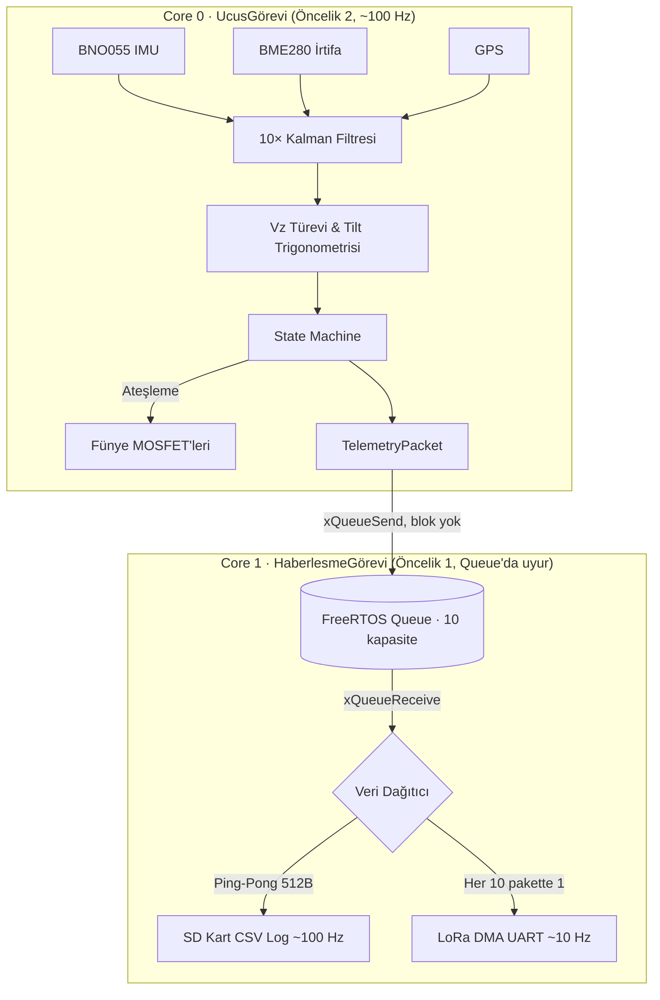

# 🚀 Trakya Roket 2026 — Uçuş Kontrol Bilgisayarı (Uçuş Yazılımı V2.0)
## Mühendislik Tasarım Raporu ve Teknik Dokümantasyon


Bu depo, **Trakya Roket Takımı 2026** yarışma isterleri (TEKNOFEST / IREC) doğrultusunda sıfırdan tasarlanmış olan asenkron, hata toleranslı ve deterministik görev bilgisayarı yazılımını içerir. ESP32'nin çift çekirdekli yapısı ve FreeRTOS üzerine kurulu mimari; roketin apogee (tepe) noktasını mutlak güvenlikle tespit etmeyi, yanlış ayrılmaları önlemeyi ve uçuş verilerini minimum kayıpla yer istasyonuna iletmeyi hedefler.

---

## 📋 İçindekiler
1. [Özet ve Tasarım Felsefesi](#1-özet-ve-tasarım-felsefesi)
2. [Repo Yapısı ve Derleme Ortamları](#2-repo-yapısı-ve-derleme-ortamları)
3. [Sistem Mimarisi: Çift Çekirdek ve FreeRTOS](#3-sistem-mimarisi-çift-çekirdek-ve-freertos)
4. [Algoritmik Altyapı ve Matematiksel Modeller](#4-algoritmik-altyapı-ve-matematiksel-modeller)
5. [Haberleşme ve Veri İşleme Protokolleri](#5-haberleşme-ve-veri-işleme-protokolleri)
6. [SİT / SUT Entegrasyon Protokolü](#6-si̇t--sut-entegrasyon-protokolü)
7. [Hata Modları ve Etki Analizi (FMEA)](#7-hata-modları-ve-etki-analizi-fmea)
8. [Donanım Altyapısı ve Pinout](#8-donanım-altyapısı-ve-pinout)
9. [Kurulum ve Çalıştırma](#9-kurulum-ve-çalıştırma)

---

## 1. Özet ve Tasarım Felsefesi

Uçuş kontrol sistemleri (avionics), roketin aerodinamik kuvvetler altında doğru kararları saliseler içinde alabilmesini gerektirir. Önceki nesil yazılımlarda karşılaşılan **"SD kart yazma gecikmesi yüzünden sensör okumanın durması" (blocking loop)** problemini aşmak için V2.0 yazılımı tamamen **asenkron (non-blocking)** bir yapıya geçirilmiştir.

Temel ilkeler:
- **Uçuş hesabı asla beklemez:** Kritik döngü (Core 0) hiçbir I/O işleminde bloke olmaz; veriyi kuyruğa atıp devam eder.
- **Determinizm:** FreeRTOS öncelikleriyle sensör okuma + algoritma her zaman haberleşmeden önce gelir.
- **Hata toleransı:** Sensör/SD arızasında sistem durmaz, ilgili işlevi atlayıp uçuşa devam eder.
- **Çoklu-modül:** Tek depo; ana uçuş bilgisayarı, bilimsel görev yükü ve tüm donanım testleri ayrı PlatformIO ortamları olarak yönetilir.

---

## 2. Repo Yapısı ve Derleme Ortamları

Proje, Arduino IDE yerine **PlatformIO** kullanır. Her modül `platformio.ini` içinde ayrı bir ortam (`env`) olarak tanımlıdır ve `build_src_filter` ile yalnızca ilgili dosya derlenir. Böylece tek depoda, karışmadan birçok bağımsız firmware bulunur.

| Ortam (`-e`) | Kaynak Dosya | Amaç |
| :--- | :--- | :--- |
| **`ucus`** | `src/main.cpp` | **Ana Uçuş Kontrol Bilgisayarı (UKB).** Apogee tespiti, fünye kontrolü, telemetri. |
| **`sitsut`** | `SİT_SUT/SİT-SUT.cpp` | **SİT/SUT test yazılımı.** Test cihazıyla TTL/RS-232 üzerinden big-endian protokol. |
| **`gorevyuku`** | `GorevYukuYazilimi/gorevyuku.cpp` | **Bilimsel Görev Yükü (BGY).** `main.cpp` fork'u; IMU ve uçuş algoritması yok, BME280+GPS loglar. |
| **`kalman`** | `Test videolari pertinaks/kalman_test.cpp` | Kalman filtre davranışı testi. |
| **`video`** | `Test videolari pertinaks/video.cpp` | Video/LoRa aktarım testi. |
| **`i2ctest`** | `I2C_Test/i2c_test.cpp` | I2C veri yolu cihaz tarama (adres bulma). |
| **`loradinle`** | `LoRa_Dinle/lora_dinle.cpp` | Yer istasyonu tarafı — LoRa paketlerini dinler. |
| **`funye`** | `FunyeAtesleyici/funye_atesleyici.cpp` | Fünye ateşleme testi (güç → 10s → LED → 10s → fünye, varsayılan simüle). |
| **`ucusdebug`** | `Debug/main_debug.cpp` | Teşhis modu — tüm veriyi USB seri monitöre basar. |
| **`rs232`** | `RS232_Test/rs232_test.cpp` | RS-232 hattı testi (saniyede 10× `'a'`). |
| **`rs232echo`** | `RS232_Test/rs232_echo.cpp` | RS-232 RX testi (geleni hex olarak echo). |

**Derleme / yükleme örnekleri:**
```bash
pio run -e ucus   --target upload     # Ana uçuş yazılımı
pio run -e sitsut --target upload     # SİT/SUT test yazılımı
pio run -e gorevyuku --target upload  # Bilimsel görev yükü
```

> **RF Uyarısı:** Ana UKB (`ucus`) ve Görev Yükü (`gorevyuku`) gerçek uçuşta **aynı anda yayın yapar**. RF çakışmasını önlemek için her ikisinde de dosya başındaki `LORA_CHAN` değeri **farklı** seçilmelidir (frekans = 410 + CHAN MHz).

---

## 3. Sistem Mimarisi: Çift Çekirdek ve FreeRTOS

Geleneksel `loop()` döngüsü terkedilerek FreeRTOS altyapısı kurulmuştur. ESP32'nin iki çekirdeği, görevlerin kritiklik derecesine göre paylaştırılır.



### Görev Dağılımı
1. **Task1 — Core 0 (Priority 2):** En yüksek öncelikli döngü. I2C üzerinden sensörleri okur, Kalman'dan geçirir, uçuş algoritmasını koşturur ve paketi `xQueueSend(..., 0)` ile kuyruğa atar. Kuyruk doluysa **beklemez**, paketi atlar — uçuş hesabı asla gecikmez. Döngü sonundaki `vTaskDelay(10ms)` hem ~100 Hz frekansı hem de watchdog güvenliğini sağlar.
2. **Task2 — Core 1 (Priority 1):** `xQueueReceive` içinde uyur (CPU %0). Veri gelince uyanır, SD ping-pong tamponuna kopyalar ve her 10. pakette bir LoRa'ya asenkron basar.

---

## 4. Algoritmik Altyapı ve Matematiksel Modeller

### Sensör Füzyonu ve 1D Kalman Filtreleri
Donanımsal gürültüyü (özellikle motor titreşiminin barometreye etkisi) bastırmak için her ölçüm ekseni ayrı bir 1 boyutlu `SimpleKalmanFilter` nesnesinden geçer. Ana uçuş yazılımında **10 filtre** çalışır:

| Grup | Filtre Sayısı | Parametre (e_mea, e_est, q) | Not |
| :--- | :---: | :--- | :--- |
| BNO055 (ivme×3, gyro×3, euler×3) | 9 | `2.906, 9.982, 0.3884` | Ölçülen IMU gürültüsüne göre ayarlandı |
| BME280 (yalnız irtifa) | 1 | `16.3, 264, 0.1112` | Ağır yumuşatma → pürüzsüz irtifa (hafif lag) |

> **Optimizasyon:** BME280'den yalnızca **irtifa** okunur; basınç/sıcaklık/nem uçuş kararında kullanılmadığı için 100 Hz'de gereksiz I2C okuması yapılmaz. (SİT/SUT modülü, test gereksinimi nedeniyle 4 alanı da okur ve 13 filtre çalıştırır.)

### Anlık Dikey Hız (Vz) ve Eğim Açısı
**1. Dikey Hız (mikrosaniye hassas türev):**
```text
Vz = (Güncel İrtifa − Önceki İrtifa) / Δt   ,  Δt = micros() farkı (sn)
```
Bölme hatasına (Δt ≤ 0) ve ilk ölçüme karşı korumalıdır.

**2. Eğim (Tilt) Açısı:**
```text
Tilt = acos( cos(Pitch) · cos(Roll) ) · (180 / π)
```
Kalman gürültüsü `cos(p)·cos(r)` çarpımını 1.0'ı aşırırsa, kodda `constrain(..., -1, 1)` ile **NaN koruması** yapılır (aksi halde apogee asla tetiklenmez).

### Apogee Tespiti ve Durum Makinesi
Durum makinesi 5 fazdan oluşur: `HAZIR → YUKSELIYOR → INIS_1 → INIS_2 → INDI`.

`YUKSELIYOR → INIS_1` (drogue ayrılma) geçişi **üçlü çapraz onaya** bağlıdır:

1. **Bağıl irtifa:** `Güncel İrtifa < (Maks İrtifa − 15 m)`
2. **Kinetik:** `Vz < 0` (hız yön değiştirdi)
3. **Güvenlik (tumbling):** `Tilt < 10°`

> **Neden güvenlik onayı?** Roket motor arızasıyla yatay uçuşa geçerse veya takla atarsa, statik deliklerdeki dinamik basınç barometreyi yanıltıp "sahte irtifa düşüşü" gösterebilir. `Tilt < 10°` şartı, roket yatay/takla halindeyken fünye ateşlemesini **kesin engeller**.

`INIS_1 → INIS_2` (ana paraşüt) geçişi: `irtifa < 550 m` **ve** `max_irtifa > 550 m`. İniş: `Vz ≈ 0` ve `irtifa < 20 m`.

---

## 5. Haberleşme ve Veri İşleme Protokolleri

### LoRa Telemetri Paketi (Packed Struct + CRC)
Payload, bant genişliğini maksimize etmek için `#pragma pack(push, 1)` ile byte boşluksuz paketlenir. **Ana uçuş yazılımı (`ucus`)** paketi:

| Alan | Boyut | İçerik |
| :--- | :--- | :--- |
| `float` ×3 | 12 B | ivmeX, ivmeY, ivmeZ |
| `float` ×3 | 12 B | gyroX, gyroY, gyroZ |
| `float` ×3 | 12 B | roll, pitch, yaw |
| `float` ×3 | 12 B | irtifa, dikeyHiz, eglimAcisi |
| `float` ×2 | 8 B | gpsEnlem, gpsBoylam |
| `bool` ×2 | 2 B | ayrilma1, ayrilma2 |
| `uint8_t` | 1 B | ucus_durumu (0–4) |
| **Payload** | **59 B** | |

Tam çerçeve: `[0xAA][0x55][LEN=59][…59 B…][CRC16_HI][CRC16_LO]` = **64 byte**.
UART hattındaki bit flip / ring-buffer kayması **CRC16-CCITT** (poly `0x1021`, init `0xFFFF`) ile tespit edilir; yer istasyonu CRC tutmayan paketi reddeder.

> SİT/SUT modülünün paketi basınç/sıcaklık/nem alanlarını da içerdiğinden **71 B payload / 76 B çerçeve**dir. İki firmware farklı paket boyutu kullanır.

### E32-433T30D Otomatik Konfigürasyon
LoRa modülü, açılışta yazılım tarafından yapılandırılır: `M0/M1` pinleriyle config moduna alınır, `{0xC0, ADDH, ADDL, SPED, CHAN, OPTION}` paketi kalıcı olarak yazılır ve normal (transparan) moda dönülür. Adres/kanal/güç ayarları dosya başındaki **"YARIŞMA ALANI"** define bloğundan gelir. Gönderim ESP-IDF UART sürücüsü (`uart_write_bytes`, 2048 B TX ring-buffer) ile **asenkron** yapılır → CPU beklemez.

### SD Kart Ping-Pong Buffer
SPI üzerinden SD yazımı 5–20 ms (wear-leveling anında 200 ms'ye kadar) sürebilir; bu uçuş kontrolünü dondurur. Çözüm: **512 byte'lık A/B tamponları** (`heap_caps_malloc(MALLOC_CAP_DMA)`):
1. CSV satırları aktif tampona dolar.
2. Tampon dolunca toplu (DMA-dostu) tek `write` ile karta basılır.
3. Diğer tampona geçilir; CPU beklemeden loglamaya devam eder.
Her ~1 sn ve **iniş (`INDI`) anında** tampon diske zorla boşaltılır → güç kesintisinde veri kaybı en fazla ~1 sn ile sınırlanır.

---

## 6. SİT / SUT Entegrasyon Protokolü

Yarışma komitesinin zorunlu tuttuğu testler için `sitsut` firmware'i, roketin test cihazıyla haberleşmesini sağlar.

- **SİT (Sensör İzleme Testi):** Gerçek sensör verisini işlemeden, olduğu gibi test cihazına gönderir. *"Roket şu an ne görüyor?"*
- **SUT (Sentetik Uçuş Testi):** Gerçek sensörleri yok sayar; test cihazından gelen yapay veriyle uçuş algoritmasını (apogee, fünye) çalıştırır. *"Roket bu veriyi alsa ne yapardı?"*

### Fiziksel Katman (Ek-7 Tablo 7)
| Parametre | Değer |
| :--- | :--- |
| Arayüz | UART0 → **MAX3232 → RS-232** |
| Baud | **115200** |
| Çerçeveleme | 8N1 (parity yok, 1 stop) |
| Frame timeout | 100 ms |

### ⚙️ Byte Sırası: BIG ENDIAN (kritik)
Ek-7, tüm çok-baytlı alanların **big-endian (MSB first)** gönderilmesini zorunlu kılar. ESP32 native little-endian olduğundan, tüm `FLOAT32` alanları `float_to_be32` / `be32_to_float` ile çevrilir. *(Bu çeviri atlanırsa test cihazı veriyi tersten okur — irtifa "7 milyon" gibi çöp değerler görünür.)*

### Komut Protokolü (5 byte)
`[0xAA][Command][Checksum][0x0D][0x0A]`

| Komut | Byte | Kabul edilen Checksum'lar |
| :--- | :---: | :--- |
| SİT Başlat | `0x20` | `0x8C` (Tablo 1: cmd+0x6C) **veya** `0xCA` (0xAA+cmd) |
| SUT Başlat | `0x22` | `0x8E` **veya** `0xCC` |
| Durdur | `0x24` | `0x90` **veya** `0xCE` |

> Parser **her iki checksum konvansiyonunu da** kabul eder; karşı cihaz hangisini gönderirse göndersin komut geçerli sayılır. Başlat komutları onaydan **1 sn sonra** aktif olur.

### Veri Paketleri
- **SİT telemetri (Tablo 3, 36 byte):** `[0xAB][8× FLOAT32 big-endian: irtifa, basınç(mBar), ivmeX/Y/Z, açıX/Y/Z][CHK][0x0D][0x0A]`. 10 Hz.
- **SUT durum bilgilendirme (Tablo 6, 6 byte):** `[0xAA][Data1][Data2][CHK][0x0D][0x0A]`. `Data1` = uçuş aşaması bayrakları (bit 0–7: kalkış, motor yanma, min irtifa, açı eşiği, alçalma, drogue emri, ana irtifa, ana emir).

### SD Kart Loglama — Türkçe Excel Uyumlu CSV
SİT/SUT firmware'inde kara kutu logu, Türkçe Excel'de doğrudan sütunlara açılacak biçimdedir:
- **Ayraç `;`**, **ondalık `,`** (sayılar Excel'de gerçek sayı → grafik/formül çalışır).
- İlk sütun `zaman_ms` (millis zaman damgası).
- **Otomatik numaralı dosya:** her açılışta üzerine yazmaz; `ucus_log_7.csv` varsa `ucus_log_8.csv` açar.

---

## 7. Hata Modları ve Etki Analizi (FMEA)

| Arıza Modu | Sistemin Tepkisi |
| :--- | :--- |
| **BME280 / BNO055 bulunamıyor (ana uçuş)** | `bno.begin` / `bme.begin` başarısızsa sistem kritik durur (uçuş sensörsüz güvenli değildir). SİT/SUT modülünde ise sensör yoksa yalnızca uyarı basılır, test devam eder. |
| **BNO055 kalibrasyon gecikmesi** | Kalibrasyon `sys ≥ 1` beklenir ama **~15 sn timeout** vardır — rampada sonsuza kilitlenmez, süre dolarsa devam eder. IMU modu (0x08) kullanılır; manyetometre ve harici kristal **kullanılmaz** (klon modül uyumu). |
| **SD kart yok / çıkmış** | `SD.begin` başarısızsa `sdOk = false`; loglama atlanır, uçuş döngüsü ve LoRa kayıpsız sürer. |
| **Fünye MOSFET'i açık kalması** | Ateşleme `delay()` kullanmaz; `millis()` damgası alınır, `funye_guncelle()` tam 400 ms sonra donanımsal olarak keser. |
| **FreeRTOS kuyruğu şişmesi** | Core 1 gecikirse Core 0 `xQueueSend(..., 0)` ile beklemeyi reddeder, paketi atlar. |
| **UART bit flip / gürültü** | Uygulama katmanı CRC16-CCITT paketi doğrular; SİT/SUT'ta checksum + footer kontrolü yapılır. |

---

## 8. Donanım Altyapısı ve Pinout

| Donanım | Sinyal | ESP32 Pin | Notlar |
| :--- | :--- | :---: | :--- |
| **I2C Veriyolu** | SDA / SCL | `21` / `22` | BNO055 (`0x28`), BME280 (`0x76`/`0x77`) |
| **SPI (SD Kart)** | SCK / MISO / MOSI | `18` / `19` / `23` | — |
| **SD Kart** | CS / DET | `5` / `35` | DET input pull-up |
| **GPS (GY-NEO-7M)** | RX / TX | `17` / `16` | 9600 baud, UART2 |
| **LoRa (E32-433T30D)** | TX / RX | `33` / `32` | 9600 baud, UART1 (DMA ring-buffer 2048 B) |
| **LoRa Mod** | M0 / M1 | `15` / `2` | Config/normal mod geçişi |
| **Fünyeler (MOSFET)** | Fünye 1 / 2 | `27` / `14` | Normalde LOW, 400 ms HIGH |
| **Uyarı** | Buzzer / LED 1,2,3 | `12` / `26, 4, 25` | Uçuş fazı / hata sinyali |
| **SİT/SUT TTL** | UART0 RX / TX | `3` / `1` | Yalnız `sitsut` — MAX3232 üzerinden RS-232 |

> `ucus` firmware'inde TTL (UART0) kullanılmaz — Serial hiç başlatılmaz, pinler boştadır. UART0 yalnızca `sitsut` modülünde test cihazı haberleşmesi için kullanılır.

---

## 9. Kurulum ve Çalıştırma

### Kurulum
1. **VS Code** + **PlatformIO IDE** eklentisini kurun.
2. Depoyu klonlayıp PlatformIO'da açın.
3. Kütüphaneler (`Adafruit BNO055`, `Adafruit BME280`, `TinyGPSPlus`, `Adafruit Unified Sensor`) `platformio.ini`'den otomatik iner.
4. İstediğiniz ortamı seçip derleyin/yükleyin (bkz. [Bölüm 2](#2-repo-yapısı-ve-derleme-ortamları)).

### SİT/SUT Testi
- Roketi test cihazına (veya PC'ye TTL-USB / RS-232 ile) bağlayın.
- Lokal deneme için `SİT_SUT/sit_sut_test.py` yer istasyonu simülatörünü çalıştırın (komut gönderme, SUT senaryosu, ham hex teşhis modları içerir). Python tarafı da firmware ile birebir **big-endian**'dır.

### Uçuş Öncesi Zorunlu Kontroller (Pre-Flight)
- [ ] ESP32 enerjilendikten sonra roket rampada **sabit tutulmalı** — BME280 yer basıncını (0 m referansı) 20 örnekle kalibre eder.
- [ ] BNO055 kalibrasyonu için `sys ≥ 1/3` beklenir (max ~15 sn timeout).
- [ ] Fünye hat sürekliliği (continuity) ve pil voltajı mekanik ekip tarafından son kez kontrol edilmeli.
- [ ] UKB ve Görev Yükü `LORA_CHAN` değerlerinin **farklı** olduğu doğrulanmalı.

---

**Trakya Roket Takımı 2026** — *Per aspera ad astra!*
