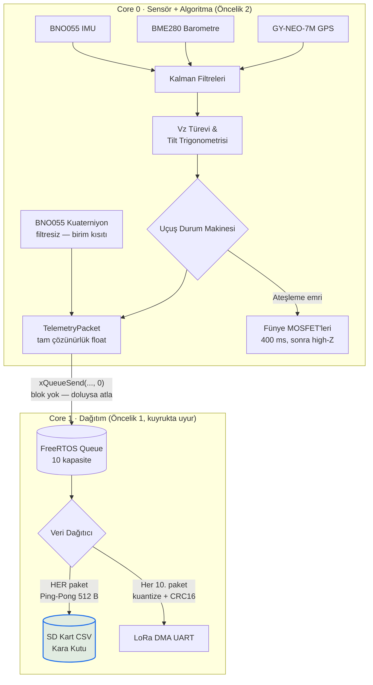
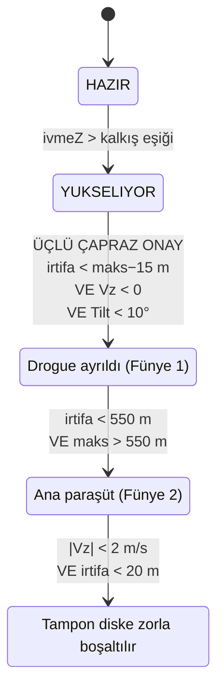
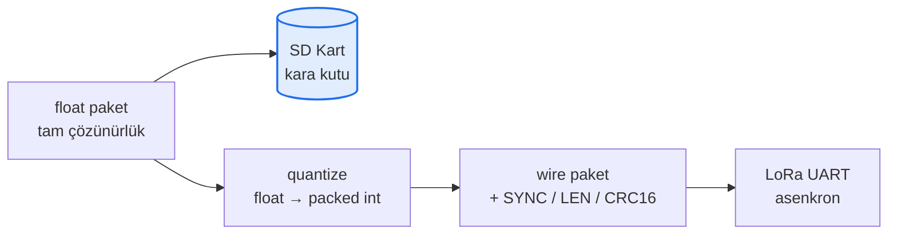

# 🚀 Trakya Roket 2026 — Uçuş Yazılımı

## Mühendislik Tasarım Raporu ve Teknik Dokümantasyon


Bu depo, **Trakya Roket Takımı 2026** yarışma isterleri (TEKNOFEST / IREC) doğrultusunda sıfırdan tasarlanmış olan asenkron, hata toleranslı ve deterministik uçuş yazılımını içerir. Depoda **iki bağımsız uçuş bilgisayarı** yazılımı bulunur:

- **UKB — Uçuş Kontrol Bilgisayarı** (`src/main.cpp`): apogee tespiti, kurtarma sistemi ayrılma kararları, uçuş telemetrisi.
- **BGY — Bilimsel Görev Yükü** (`GorevYukuYazilimi/gorevyuku.cpp`): atmosferik ölçüm, hava yoğunluğu hesabı, bilimsel veri kaydı.

İki sistem uçuşta ayrılarak bağımsız iki gövde olarak yere iner; her biri kendi kartı, güç kaynağı, GPS alıcısı ve radyo vericisine sahiptir. Aralarında hiçbir kablolu bağlantı veya bağımlılık yoktur.

---

## 📋 İçindekiler

1. [Özet ve Tasarım Felsefesi](#1-özet-ve-tasarım-felsefesi)
2. [Repo Yapısı ve Derleme Ortamları](#2-repo-yapısı-ve-derleme-ortamları)
3. [Sistem Mimarisi: Çift Çekirdek ve FreeRTOS](#3-sistem-mimarisi-çift-çekirdek-ve-freertos)
4. [Uçuş Algoritması ve Matematiksel Modeller](#4-uçuş-algoritması-ve-matematiksel-modeller)
5. [Bilimsel Görev Yükü (BGY)](#5-bilimsel-görev-yükü-bgy)
6. [Haberleşme: Fixed-Point Wire Protokolü](#6-haberleşme-fixed-point-wire-protokolü)
7. [SD Kart Kara Kutu Loglama](#7-sd-kart-kara-kutu-loglama)
8. [SİT / SUT Entegrasyon Protokolü](#8-si̇t--sut-entegrasyon-protokolü)
9. [Güvenlik Tasarımı: Fünye Pin Yönetimi](#9-güvenlik-tasarımı-fünye-pin-yönetimi)
10. [Hata Modları ve Etki Analizi (FMEA)](#10-hata-modları-ve-etki-analizi-fmea)
11. [Donanım Altyapısı ve Pinout](#11-donanım-altyapısı-ve-pinout)
12. [Yer İstasyonu (Ayrı Depo)](#12-yer-i̇stasyonu-ayrı-depo)
13. [Doğrulama ve Test](#13-doğrulama-ve-test)
14. [Kurulum ve Çalıştırma](#14-kurulum-ve-çalıştırma)
15. [Dokümantasyon İndeksi](#15-dokümantasyon-i̇ndeksi)

---

## 1. Özet ve Tasarım Felsefesi

Uçuş kontrol sistemleri, roketin aerodinamik kuvvetler altında doğru kararları saliseler içinde alabilmesini gerektirir. Önceki nesil yazılımlarda karşılaşılan **"SD kart yazma gecikmesi yüzünden sensör okumanın durması" (blocking loop)** problemini aşmak için yazılım tamamen **asenkron (non-blocking)** bir yapıya geçirilmiştir.

Temel ilkeler:

- **Uçuş hesabı asla beklemez.** Kritik döngü (Core 0) hiçbir I/O işleminde bloke olmaz; veriyi kuyruğa atıp devam eder.
- **Determinizm.** FreeRTOS öncelikleriyle sensör okuma + algoritma her zaman haberleşmeden önce gelir.
- **Hata toleransı.** Sensör/SD arızasında sistem durmaz, ilgili işlevi atlayıp uçuşa devam eder — tek istisna, o sistemin varlık nedeni olan sensörün yokluğudur.
- **Donanımsal güvenlik yazılım hatasını aşar.** Fünye pinleri normalde high-Z'de tutulur; hiçbir yazılım hatası tek başına ateşleme yapamaz (bkz. [Bölüm 9](#9-güvenlik-tasarımı-fünye-pin-yönetimi)).
- **Veri kaybı RF'e bağlı değildir.** Telemetri uçuş anında izleme amacı taşır; verinin kaynağı kart üzerindeki kara kutudur.
- **Çoklu-modül tek depo.** Ana uçuş bilgisayarı, bilimsel görev yükü ve tüm donanım testleri ayrı PlatformIO ortamları olarak yönetilir.

---

## 2. Repo Yapısı ve Derleme Ortamları

Proje, Arduino IDE yerine **PlatformIO** kullanır. Her modül `platformio.ini` içinde ayrı bir ortam (`env`) olarak tanımlıdır ve `build_src_filter` ile yalnızca ilgili dosya derlenir. Böylece tek depoda, karışmadan birçok bağımsız firmware bulunur.

### Uçuş firmware'leri

| Ortam (`-e`) | Kaynak Dosya | Amaç |
| :--- | :--- | :--- |
| **`ucus`** | `src/main.cpp` | **Ana Uçuş Kontrol Bilgisayarı (UKB).** Apogee tespiti, fünye kontrolü, uçuş telemetrisi. |
| **`gorevyuku`** | `GorevYukuYazilimi/gorevyuku.cpp` | **Bilimsel Görev Yükü (BGY).** Atmosferik ölçüm + hava yoğunluğu + yönelim. Uçuş algoritması ve fünye **yok**. |
| **`sitsut`** | `SİT_SUT/SİT-SUT.cpp` | **SİT/SUT test yazılımı.** Test cihazıyla TTL/RS-232 üzerinden big-endian protokol. |

### Teşhis firmware'leri

| Ortam (`-e`) | Kaynak Dosya | Amaç |
| :--- | :--- | :--- |
| **`ucusdebug`** | `Debug/main_debug.cpp` | UKB teşhis modu — tüm veriyi USB seri monitöre basar. |
| **`gorevyukudebug`** | `Debug/gorevyuku_debug.cpp` | BGY teşhis modu — tüm veriyi USB seri monitöre basar. |

### Donanım doğrulama testleri

| Ortam (`-e`) | Kaynak Dosya | Amaç |
| :--- | :--- | :--- |
| **`i2ctest`** | `I2C_Test/i2c_test.cpp` | I²C veri yolu cihaz tarama (adres bulma). |
| **`gpstest`** | `GPS_Test/gps_test.cpp` | GPS modülünü tek başına test eder. |
| **`loratest`** | `LoRa_Test/lora_test.cpp` | LoRa izole gönderim testi. |
| **`loradinle`** | `LoRa_Dinle/lora_dinle.cpp` | LoRa alıcı tarafı — gelen paketleri dinler. |
| **`funye`** | `FunyeAtesleyici/funye_atesleyici.cpp` | Fünye ateşleme testi (güç → 10 s → LED → 10 s → fünye; **varsayılan simüle**). |
| **`kalman`** | `Test videolari pertinaks/kalman_test.cpp` | Kalman filtre davranışı testi. |
| **`video`** | `Test videolari pertinaks/video.cpp` | Video/LoRa aktarım testi. |
| **`rs232`** | `RS232_Test/rs232_test.cpp` | RS-232 hattı testi (saniyede 10× `'a'`). |
| **`rs232echo`** | `RS232_Test/rs232_echo.cpp` | RS-232 RX testi (geleni hex olarak echo). |
| **`esp32dev`** | `test/test_ucus/test_main.cpp` | Unity birim testleri (`pio test`). |

**Derleme / yükleme örnekleri:**

```bash
pio run -e ucus      --target upload   # Ana uçuş yazılımı
pio run -e gorevyuku --target upload   # Bilimsel görev yükü
pio run -e sitsut    --target upload   # SİT/SUT test yazılımı
pio run -e ucus -e gorevyuku           # Yalnız derle (yükleme yok)
```

> ### ⚠️ Kart–firmware eşleşmesi (fiziksel hasar riski)
>
> UKB ve BGY **ayrı fiziksel kartlardır** ve GPIO 27 / 14 pinlerini **farklı amaçlarla** kullanır:
>
> | Pin | UKB (`ucus`) | BGY (`gorevyuku`) |
> | :---: | :--- | :--- |
> | `27` | **Fünye 1 MOSFET** | Kurtarma buzzer'ı |
> | `14` | **Fünye 2 MOSFET** | Kurtarma beacon LED'i |
>
> `gorevyuku` firmware'i UKB kartına yüklenirse, kurtarma beacon task'ı saniyede bir bu pinleri HIGH'a çeker — yani **fünye MOSFET gate'lerini sürer.** Yükleme öncesi hangi karta bastığınızı doğrulayın; fünyeler bağlıyken asla yanlış firmware yüklemeyin.

> ### 📡 RF çakışma uyarısı
>
> UKB ve BGY gerçek uçuşta **aynı anda yayın yapar.** RF çakışmasını önlemek için her iki dosyanın başındaki `LORA_CHAN` değeri **farklı** seçilmelidir (taşıyıcı frekans = `410 + CHAN` MHz). Her iki firmware de açılışta modülü kendi ayarlarıyla yeniden yapılandırdığından, kanal ayarı yalnız kaynak dosyadan yönetilir.

---

## 3. Sistem Mimarisi: Çift Çekirdek ve FreeRTOS

Geleneksel `loop()` döngüsü terkedilerek FreeRTOS altyapısı kurulmuştur. ESP32'nin iki çekirdeği, görevlerin kritiklik derecesine göre paylaştırılır. Her iki uçuş bilgisayarı da aynı üretim/dağıtım mimarisini kullanır.


```mermaid
graph TD
    subgraph CORE0["Core 0 · Sensör + Algoritma (Öncelik 2)"]
        S1[BNO055 IMU] --> KF[Kalman Filtreleri]
        S2[BME280 Barometre] --> KF
        S3[GY-NEO-7M GPS] --> KF
        S4[BNO055 Kuaterniyon<br/>filtresiz — birim kısıtı] --> PKT
        KF --> CALC[Vz Türevi &<br/>Tilt Trigonometrisi]
        CALC --> SM{Uçuş Durum Makinesi}
        SM -->|Ateşleme emri| F1[Fünye MOSFET'leri<br/>400 ms, sonra high-Z]
        SM --> PKT[TelemetryPacket<br/>tam çözünürlük float]
    end

    PKT -->|"xQueueSend(..., 0)<br/>blok yok — doluysa atla"| Q[(FreeRTOS Queue<br/>10 kapasite)]

    subgraph CORE1["Core 1 · Dağıtım (Öncelik 1, kuyrukta uyur)"]
        Q --> DISPATCH{Veri Dağıtıcı}
        DISPATCH -->|HER paket<br/>Ping-Pong 512 B| SD[(SD Kart CSV<br/>Kara Kutu)]
        DISPATCH -->|Her 10. paket<br/>kuantize + CRC16| LORA[LoRa DMA UART]
    end

    classDef safe fill:#1f6feb22,stroke:#1f6feb,stroke-width:2px
    class SD safe
```

### Görev dağılımı

**Task1 — Core 0 (Priority 2).** En yüksek öncelikli döngü. I²C üzerinden sensörleri okur, Kalman'dan geçirir, uçuş algoritmasını koşturur ve paketi `xQueueSend(..., 0)` ile kuyruğa atar. Kuyruk doluysa **beklemez**, paketi atlar — uçuş hesabı asla gecikmez.

**Task2 — Core 1 (Priority 1).** Kuyrukta uyur (CPU ~%0). Veri gelince uyanır, SD ping-pong tamponuna kopyalar ve her 10. pakette bir LoRa'ya asenkron basar.

### Gerçek zamanlama

Döngü sonundaki `vTaskDelay(10 ms)` hem hedef frekansı hem de watchdog güvenliğini sağlar. Ancak bu **nominal** değerdir: sensörlerin I²C okuma süresi periyoda eklenir.

| | Nominal | Ölçülen (UKB kartı) |
| :--- | :---: | :---: |
| Core 0 sensör döngüsü | 100 Hz | ~65 Hz |
| SD kayıt (her paket) | 100 Hz | ~65 Hz |
| LoRa telemetri (`ORANI = 10`) | 10 Hz | ~6–7 Hz |

> **RF bant genişliği kısıtı:** E32 hava hızı `SPED = 0x1C` ile **9,6 kbps**'dir; ancak FEC, preamble ve alt-paket yükü nedeniyle ölçülen efektif kapasite ~**330 B/s**'dir. Menzil şartı ≥ 4 km olduğundan **RF parametrelerine (`SPED` / `OPTION` / FEC / hava hızı) dokunulmamalıdır**; telemetri hızı yalnızca paket küçültme veya `LORA_GONDERIM_ORANI` ile yönetilir.

Mevcut yük (`ORANI = 10`), Core 0 döngü hızına doğrudan bağlıdır:

| Core 0 döngüsü | UKB (28 B) | BGY (37 B) | BGY tavan payı |
| :---: | :---: | :---: | :---: |
| 100 Hz (nominal) | 10 Hz → 280 B/s | 10 Hz → **370 B/s** | **%112 — taşar** |
| 80 Hz | 8 Hz → 224 B/s | 8 Hz → 296 B/s | %90 |
| ~65 Hz (UKB'de ölçülen) | 6,5 Hz → 182 B/s | 6,5 Hz → 240 B/s | %73 |
| ~50 Hz | 5 Hz → 140 B/s | 5 Hz → 185 B/s | %56 |

> ### ⚠️ BGY bant genişliği payı döngü hızına bağımlıdır
>
> BGY paketi 37 B olduğundan, döngü **nominal 100 Hz'e yaklaşırsa** `ORANI = 10` ile hava kapasitesi aşılır (370 > 330 B/s) → paket kaybı ve TX tampon şişmesi. Şu an sığmasının nedeni döngünün sensör I²C yükü altında ~65 Hz'de kalmasıdır — yani **tasarım, döngünün yavaş olmasına bel bağlıyor.**
>
> Bu, sensör okumasını hızlandıran her iyileştirmeyi (ör. I²C saatini 100 kHz'den 400 kHz'e çıkarmak) gizli bir regresyona dönüştürür. Böyle bir değişiklik yapılırsa `LORA_GONDERIM_ORANI` **13–14'e çıkarılmalıdır** (100 Hz'de bile ~%80 pay bırakır). Uçuş öncesi gerçek hız `hz_olcer.py` ile ölçülmelidir.

---

## 4. Uçuş Algoritması ve Matematiksel Modeller

### 4.1 Sensör füzyonu ve 1D Kalman filtreleri

Donanımsal gürültüyü (özellikle motor titreşiminin barometreye etkisi) bastırmak için her ölçüm ekseni ayrı bir 1 boyutlu `SimpleKalmanFilter` nesnesinden geçer. Ana uçuş yazılımında **10 filtre** çalışır:

| Grup | Filtre | Parametre (`e_mea`, `e_est`, `q`) | Not |
| :--- | :---: | :--- | :--- |
| BNO055 ivme ×3, gyro ×3, Euler ×3 | 9 | `2.906, 9.982, 0.3884` | Ölçülen IMU gürültüsüne göre ayarlandı |
| BME280 irtifa | 1 | `1.5, 1.5, 0.1` | Apogee kararını besler |
| **BNO055 kuaterniyon** | **0** | — | **Bilinçli filtresiz** (aşağıya bakınız) |

**Kuaterniyon neden filtresiz?** Kuaterniyon bileşenleri birim uzunluk kısıtıyla (`x² + y² + z² + w² = 1`) birbirine bağlıdır. Her bileşeni ayrı bir skaler Kalman filtresinden geçirmek bu kısıtı bozar ve fiziksel olarak geçersiz bir yönelim üretir. Bu nedenle kuaterniyon BNO055'in kendi füzyon çıkışından ham olarak alınır.

**Optimizasyon:** UKB'de BME280'den yalnızca **irtifa** okunur; basınç/sıcaklık/nem uçuş kararında kullanılmadığı için yüksek frekansta gereksiz I²C okuması yapılmaz. (Basınç yalnız SİT modunda, Tablo 3 paketi için okunur.) Atmosferik büyüklüklerin tamamını okuyan sistem BGY'dir.

### 4.2 Anlık dikey hız (Vz) ve eğim açısı

**Dikey hız — mikrosaniye hassas türev:**

```text
Vz = (Güncel İrtifa − Önceki İrtifa) / Δt      Δt = micros() farkı [s]
```

Bölme hatasına (`Δt ≤ 0`) ve ilk ölçüme karşı korumalıdır.

**Eğim (tilt) açısı:**

```text
Tilt = acos( cos(Pitch) · cos(Roll) ) · (180 / π)      0° = tam dik
```

Kalman gürültüsü `cos(p)·cos(r)` çarpımını 1.0'ı aşırırsa `acos` NaN döner ve **apogee asla tetiklenmez**; bu nedenle çarpım `constrain(..., -1, 1)` ile kırpılır.

### 4.3 Apogee tespiti ve durum makinesi

Durum makinesi 5 fazdan oluşur: `HAZIR → YUKSELIYOR → INIS_1 → INIS_2 → INDI`.


```mermaid
stateDiagram-v2
    [*] --> HAZIR
    HAZIR --> YUKSELIYOR : ivmeZ > kalkış eşiği
    YUKSELIYOR --> INIS_1 : ÜÇLÜ ÇAPRAZ ONAY<br/>irtifa < maks−15 m<br/>VE Vz < 0<br/>VE Tilt < 10°
    INIS_1 --> INIS_2 : irtifa < 550 m<br/>VE maks > 550 m
    INIS_2 --> INDI : \|Vz\| < 2 m/s<br/>VE irtifa < 20 m
    INIS_1 : Drogue ayrıldı (Fünye 1)
    INIS_2 : Ana paraşüt (Fünye 2)
    INDI : Tampon diske zorla boşaltılır
```

`YUKSELIYOR → INIS_1` (drogue ayrılma) geçişi **üçlü çapraz onaya** bağlıdır:

1. **Bağıl irtifa:** `Güncel İrtifa < (Maks İrtifa − 15 m)`
2. **Kinetik:** `Vz < 0` — hız yön değiştirdi
3. **Güvenlik (tumbling):** `Tilt < 10°`

> **Üçüncü onay neden var?** Roket motor arızasıyla yatay uçuşa geçerse veya takla atarsa, statik deliklerdeki dinamik basınç barometreyi yanıltıp "sahte irtifa düşüşü" gösterebilir. İlk iki koşul bu senaryoda da sağlanır. `Tilt < 10°` şartı, roket yatay veya takla halindeyken fünye ateşlemesini **kesin engeller.**

**Eşik özeti:**

| Sabit | Değer | Rol |
| :--- | :---: | :--- |
| `KALKIS_IVME_ESIGI` | 20 m/s² | `HAZIR → YUKSELIYOR` geçişi |
| `APOGEE_IRTIFA_FARKI` | 15 m | Apogee bağıl irtifa onayı |
| `MAX_EGLIM` | 10° | Apogee güvenlik (tumbling) onayı |
| `AYRILMA2_MESAFE` | 550 m | Ana paraşüt açılma irtifası |
| `INIS_HIZ_ESIGI` / `INIS_IRTIFA_ESIGI` | 2 m/s / 20 m | İniş tespiti |
| `FUNYE_SURE_MS` | 400 ms | Fünye enerjilenme süresi |

> SUT modunda eğim kapısı `SUT_MAX_EGLIM = 180°` ile devre dışı bırakılır (tezgahta roket dik tutulamaz). Bu **mod-koşullu** bir istisnadır; gerçek uçuş yolunda (`MOD_BEKLEME`) kapı 10°'de kalır.

### 4.4 LED durum göstergesi

Üç durum LED'i (GPIO 26 / 4 / 25) uçuş fazını ve sistem hazırlığını görsel olarak bildirir: yapılandırma tamamlanana kadar 1 Hz yanıp söner, sistem hazır olduğunda davranışı durum makinesine bağlanır. Ayrılma göstergeleri ayrıca isimlendirilmiştir (`PIN_LED_DROGUE` = GPIO 26, `PIN_LED_ANA` = GPIO 4). Karar mantığı donanımdan bağımsız saf bir fonksiyonda tutulur; böylece birim testle doğrulanabilir.

---

## 5. Bilimsel Görev Yükü (BGY)

BGY'nin bilimsel görevi, **uçuş boyunca atmosferin düşey profilini ölçmek ve bu profilden hava yoğunluğunu türetmektir.** Yazılım açısından üç fonksiyona ayrılır:

| | Fonksiyon | Ölçülen / hesaplanan |
| :---: | :--- | :--- |
| **F1** | Atmosferik durum ölçümü | mutlak basınç, sıcaklık, bağıl nem, barometrik irtifa |
| **F2** | **Hava yoğunluğu hesabı** | nemli hava yoğunluğu (kart üzerinde türetilir) |
| **F3** | Ölçüm bağlamı | GPS konumu, bileşke ivme, jiroskop, yönelim kuaterniyonu |

### 5.1 Nemli hava yoğunluğu (F2)

Yoğunluk doğrudan ölçülebilen bir büyüklük değildir; kuru hava ve su buharı ayrı ideal gazlar olarak ele alınıp kısmi yoğunlukların toplanmasıyla türetilir. Doymuş buhar basıncı **Tetens** bağıntısıyla bulunur:

```text
es(T) = 6.1078 · 10^(7.5·T / (T + 237.3))              [hPa]   doymuş buhar basıncı
pv    = (RH/100) · es                                   [hPa]   kısmi buhar basıncı
pd    = p − pv                                          [hPa]   kuru havanın kısmi basıncı
ρ     = (pd·100)/(Rd·Tk) + (pv·100)/(Rv·Tk)             [kg/m³]
        Rd = 287.058    Rv = 461.495 J/(kg·K)    Tk = T + 273.15
```

Su buharı kuru havadan hafif olduğu için nem yoğunluğu **düşürür**. Sıcak-nemli bir günde (35 °C, %100 bağıl nem) nemin ihmal edilmesi ~%2 hata üretir; bu, sürükleme hesabında doğrudan görünen bir sapmadır. BME280 bağıl nem kanalını zaten içerdiğinden doğru olan nemli hava modelidir.

Hesap **filtrelenmiş** girdiler üzerinden yapılır ve türetilmiş sonuca **ikinci bir Kalman uygulanmaz** — girdilerin üçü de filtreli olduğundan ek filtre yalnız gecikme bindirirdi. Bozuk sensöre karşı bağıl nem `[0, 100]` aralığına, `pv` toplam basınca kırpılır; sıfıra bölme korumaları uygulanır. Hiçbir koşulda `NaN`, sonsuz veya negatif yoğunluk üretilmez.

**Doğrulama:** 1013.25 hPa / 15 °C / %0 nem → **1.2250 kg/m³** (ISA deniz seviyesi değeri) · aynı koşulda %100 nem → **1.2172 kg/m³**.

### 5.2 Yer kalibrasyonu

Barometrik irtifanın anlamlı olması için kalkış noktasının basıncı bilinmelidir. Her iki firmware de açılışta **20 basınç örneğinin ortalamasını** referans basınç olarak saklar; tüm irtifa değerleri bu referansa göre hesaplanır. Böylece o günün hava durumundan bağımsız, kalkış noktasına göre yerden yükseklik elde edilir; sabit bir standart atmosfer değeri varsayılmaz. Ölçülen referans basınç LoRa teşhis mesajı olarak yayınlanır.

### 5.3 Kurtarma beacon'ı

BGY, iniş sonrası arazide bulunabilmek için buzzer + LED beacon içerir. Beacon, `setup()`'ın **en başında bağımsız bir FreeRTOS task'ı** olarak başlatılır; buzzer ve LED aynı `millis()` fazından beslendiği için doğal olarak senkron çalışır (saniyede bir, 200 ms). Başlatma adımlarından hiçbiri — SD kart yokluğu, sensör bekleme, hatta BME280 bulunamayıp sonsuz hata döngüsüne girilmesi — beacon'ı durduramaz.

Bu, bilimsel görev açısından doğrudan anlamlıdır: **veri ancak kart geri alınabilirse kullanılabilir.**

Ayrıca baro + IMU durgunluğuna dayalı bir iniş tespiti (latch) mantığı mevcuttur; `BEACON_HEP_ACIK` bayrağı ile beacon'ın enerji verildiği andan itibaren mi, yoksa yalnız iniş tespitinden sonra mı çalışacağı seçilir. Bu mantık bir **uçuş algoritması değildir** — fünye sürüşü veya ayrılma kararı içermez.

> BGY yazılımı **bilinçli olarak uçuş algoritması içermez**: durum makinesi, apogee tespiti ve fünye sürüşü yoktur; bunlar UKB'nin sorumluluğundadır. Bu bir kısıt değil, tasarım kararıdır — bilimsel ölçüm yazılımındaki bir hata hiçbir koşulda kurtarma sistemini tetikleyemez.

Ayrıntı: [Bilimsel Görev Yükü — Görev Tanımı ve Yazılım Yeterliliği](docs/rapor-gorev-yuku-bilimsel-gorev-yazilim.md)

---

## 6. Haberleşme: Fixed-Point Wire Protokolü

### 6.1 İki katmanlı veri gösterimi

İç float struct'lar (kuyruk + SD + uçuş algoritması) **tam çözünürlükte** kalır. Kuantizasyon **yalnızca** LoRa'ya basılmadan hemen önce yapılır:


```mermaid
flowchart LR
    A["float paket<br/>tam çözünürlük"] --> B[("SD Kart<br/>kara kutu")]
    A --> C["quantize<br/>float → packed int"]
    C --> D["wire paket<br/>+ SYNC / LEN / CRC16"]
    D --> E["LoRa UART<br/>asenkron"]
    classDef hi fill:#1f6feb22,stroke:#1f6feb,stroke-width:2px
    class B hi
```

Böylece SD kaydı ve uçuş kararları kuantizasyondan hiç etkilenmez; bant genişliği tasarrufu yalnız RF hattında yapılır.

### 6.2 UKB telemetri paketi — 23 B (`'<7h2iB'`)

| Ofset | Alan | Tip | Ölçek |
| :---: | :--- | :--- | :--- |
| 0–1 | `ivmeToplam` | int16 | ×100 |
| 2–7 | `qx`, `qy`, `qz` | int16 ×3 | ×10000 |
| 8–13 | `irtifa`, `dikeyHiz`, `eglimAcisi` | int16 ×3 | ×10, ×10, ×100 |
| 14–21 | `gpsEnlem`, `gpsBoylam` | int32 ×2 | ×1e7 |
| 22 | `durum` | uint8 | bit0 = ayrılma1, bit1 = ayrılma2, bit2–4 = uçuş fazı |

Çerçeve: `[0xAA][0x55][LEN=23][23 B][CRC16_HI][CRC16_LO]` = **28 byte**.

### 6.3 BGY telemetri paketi — 32 B (`'<HhHhH2i7h'`)

| Ofset | Alan | Tip | Ölçek |
| :---: | :--- | :--- | :--- |
| 0–7 | `basinc`, `sicaklik`, `nem`, `irtifa` | uint16, int16, uint16, int16 | ×10, ×100, ×100, ×10 |
| 8–9 | **`yogunluk`** | uint16 | ×1000 |
| 10–17 | `gpsEnlem`, `gpsBoylam` | int32 ×2 | ×1e7 |
| 18–19 | `ivmeToplam` | int16 | ×100 |
| 20–25 | `qx`, `qy`, `qz` | int16 ×3 | ×10000 |
| 26–31 | `gyroX`, `gyroY`, `gyroZ` | int16 ×3 | ×10 |

Çerçeve: `[0xAA][0x55][LEN=32][32 B][CRC16_HI][CRC16_LO]` = **37 byte**.

### 6.4 Tasarım kararları

**Yönelim Euler yerine kuaterniyon.** BNO055'in Euler çıkışı pitch = ±90°'de (roket tam dik) **gimbal lock** yaşar; yaw aniden 160° sıçrar ve 3B poz tutmaz. Bu nedenle havadan `qx, qy, qz` gönderilir. Firmware `w ≥ 0` olacak şekilde işaret normalizasyonu yapar (`w < 0` ise üç bileşen negatiflenir; `q ≡ −q` aynı dönüşü temsil ettiği için kayıpsızdır), yer istasyonu `w = √(1 − x² − y² − z²)` ile tek anlamlı geri hesaplar. Hem bir alan tasarrufu sağlanır hem gimbal lock tamamen ortadan kalkar.

**Ham ivme eksenleri yerine bileşke ivme.** `ivmeX/Y/Z` üç slot yerine `√(x²+y²+z²)` tek slotta gider; ham üç eksen SD'de tam float kalır.

**Türetilebilir alanlar gönderilmez.** BGY'de Tetens ara değerleri (`es`, `pv`) havadan gitmez — basınç, sıcaklık ve nem zaten pakette olduğundan yerde birebir türetilebilirler.

### 6.5 Çerçeveleme ve bütünlük

UART hattındaki bit flip / ring-buffer kayması **CRC16-CCITT** (poly `0x1021`, init `0xFFFF`) ile tespit edilir; CRC yalnız faydalı yük üzerinden hesaplanır ve yer istasyonu tutmayan paketi sessizce reddeder. E32 modülü kendi RF katmanında ayrıca CRC ve FEC uygular; uygulama katmanındaki CRC ikinci koruma katmanıdır.

> ### ⚠️ Sessiz bozulma tuzağı
>
> Paket **boyutu değişmeden alan anlamı** değiştiğinde CRC bunu yakalamaz. 2026-07 döneminde UKB yönelimi Euler'den kuaterniyona geçtiğinde yer istasyonu eski yorumda kaldı; her iki düzen de 23 B olduğu için CRC tuttu ve paketler **geçerli göründü** — hata ancak `qx = 0.35` ekranda `roll = 35.00°` yazınca fark edildi. **Alan anlamı değişirse yer istasyonu aynı commit'te güncellenmelidir.**

### 6.6 E32-433T30D otomatik konfigürasyon

LoRa modülü açılışta yazılım tarafından yapılandırılır: `M0`/`M1` pinleriyle config moduna alınır, `{0xC0, ADDH, ADDL, SPED, CHAN, OPTION}` paketi yazılır ve normal (transparan) moda dönülür. Böylece havadaki ve yerdeki modülün aynı RF konfigürasyonunda olduğu her açılışta garanti altına alınır. Ayarlar dosya başındaki **"YARIŞMA ALANI"** define bloğundan gelir; `OPTION` baytı alt bileşenlerinden (TX modu, IO sürüş, WOR, FEC, TX gücü) otomatik birleşir.

Gönderim ESP-IDF UART sürücüsü (`uart_write_bytes`, 2048 B TX ring-buffer) ile **asenkron** yapılır → CPU beklemez.

---

## 7. SD Kart Kara Kutu Loglama

### 7.1 Ping-pong tampon

SPI üzerinden SD yazımı 5–20 ms (wear-leveling anında 200 ms'ye kadar) sürebilir; bu uçuş kontrolünü dondurur. Çözüm **512 byte'lık A/B tamponları** (`heap_caps_malloc(MALLOC_CAP_DMA)`):

1. CSV satırları aktif tampona dolar.
2. Tampon dolunca toplu (DMA-dostu) tek `write` ile karta basılır.
3. Diğer tampona geçilir; CPU beklemeden loglamaya devam eder.

Her ~100 paketde bir ve **iniş (`INDI`) anında** tampon diske zorla boşaltılır → güç kesintisinde veri kaybı ~1 sn ile sınırlanır.

### 7.2 Türkçe Excel uyumlu CSV

Tüm loglayan firmware'lerde kara kutu, Türkçe Excel'de çift tıkla doğrudan sütunlara açılacak biçimdedir:

- **Ayraç `;`**, **ondalık `,`** — sayılar Excel'de gerçek sayı olarak görünür, grafik/formül doğrudan çalışır.
- İlk sütun `zaman_ms` (`millis()` zaman damgası) — zamansız uçuş logu analiz edilemez.
- Başlık satırı dosya oluşturulurken bir kez yazılır.

Python/pandas tarafında: `pd.read_csv(dosya, sep=';', decimal=',')`

### 7.3 Her uçuşta yeni dosya

Açılışta ilk kullanılmamış dosya adı seçilir; önceki denemenin verisi **asla üzerine yazılmaz**:

| Firmware | Dosya serisi |
| :--- | :--- |
| `ucus` (UKB) | `/ukb_log.csv`, `/ukb_log1.csv`, `/ukb_log2.csv`, … |
| `gorevyuku` (BGY) | `/gy_log.csv`, `/gy_log1.csv`, `/gy_log2.csv`, … |

Sıra 999'a kadar taranır; dolarsa son dosyaya eklenir (log kaybetmektense birleştir). Seçilen dosya adı LoRa teşhis mesajı olarak yayınlanır, böylece hangi uçuşun hangi dosyaya yazıldığı **yerden** görülebilir.

### 7.4 Kayıt kapsamı

Kara kutu, havadan gitmeyen alanları da içerir:

| Alan | Havadan | SD kartta |
| :--- | :---: | :---: |
| Ham ivme eksenleri (X/Y/Z) | — | ✓ tam float |
| Euler açıları (roll/pitch/yaw) | — | ✓ tam float |
| Tetens ara değerleri (`es`, `pv`) — BGY | — | ✓ tam float |
| Zaman damgası | — | ✓ ms |
| Diğer tüm telemetri alanları | ✓ kuantize | ✓ tam float |

---

## 8. SİT / SUT Entegrasyon Protokolü

Yarışma komitesinin zorunlu tuttuğu testler için `sitsut` firmware'i, roketin test cihazıyla haberleşmesini sağlar.

- **SİT (Sensör İzleme Testi):** Gerçek sensör verisini işlemeden, olduğu gibi test cihazına gönderir. *"Roket şu an ne görüyor?"*
- **SUT (Sentetik Uçuş Testi):** Gerçek sensörleri yok sayar; test cihazından gelen yapay veriyle uçuş algoritmasını (apogee, fünye) çalıştırır. *"Roket bu veriyi alsa ne yapardı?"*

> **Tasarım kuralı:** SİT/SUT için yapılan hiçbir düzeltme gerçek uçuş yolunu değiştirmez. Test moduna özel davranışlar **mod-koşullu** olarak izole edilir; `MOD_BEKLEME` (normal uçuş) yolunda hiçbir test kodu etkili olmaz.

### 8.1 Fiziksel katman (Ek-7 Tablo 7)

| Parametre | Değer |
| :--- | :--- |
| Arayüz | UART0 → **MAX3232 → RS-232** |
| Baud | **115200** |
| Çerçeveleme | 8N1 (parity yok, 1 stop) |
| Frame timeout | 100 ms |

### 8.2 ⚙️ Byte sırası: BIG ENDIAN (kritik)

Ek-7, tüm çok-baytlı alanların **big-endian (MSB first)** gönderilmesini zorunlu kılar. ESP32 native little-endian olduğundan tüm `FLOAT32` alanları `float_to_be32` / `be32_to_float` ile çevrilir.

> Bu çeviri atlanırsa test cihazı veriyi tersten okur — irtifa "7 milyon" gibi çöp değerler görünür.

### 8.3 Komut protokolü (5 byte)

`[0xAA][Command][Checksum][0x0D][0x0A]`

| Komut | Byte | Kabul edilen checksum'lar |
| :--- | :---: | :--- |
| SİT Başlat | `0x20` | `0x8C` (Tablo 1: cmd + 0x6C) **veya** `0xCA` (0xAA + cmd) |
| SUT Başlat | `0x22` | `0x8E` **veya** `0xCC` |
| Durdur | `0x24` | `0x90` **veya** `0xCE` |

> Parser **her iki checksum konvansiyonunu da** kabul eder; karşı cihaz hangisini gönderirse göndersin komut geçerli sayılır. Başlat komutları onaydan **1 sn sonra** aktif olur.

### 8.4 Veri paketleri

- **SİT telemetri (Tablo 3, 36 byte):** `[0xAB][8× FLOAT32 big-endian: irtifa, basınç(mBar), ivmeX/Y/Z, açıX/Y/Z][CHK][0x0D][0x0A]`, 10 Hz. Değerler Ek-7 gereği virgülden sonra 2 basamağa yuvarlanır.
- **SUT durum bilgilendirme (Tablo 6, 6 byte):** `[0xAA][Data1][Data2][CHK][0x0D][0x0A]`. `Data1` = uçuş aşaması bayrakları (bit 0–7: kalkış, motor yanma, min irtifa, açı eşiği, alçalma, drogue emri, ana irtifa, ana emir).
- **Dahili binary telemetri:** `sitsut` firmware'i, UKB'den farklı olarak **fixed-point kuantizasyon kullanmaz**; ham float `TelemetryPacket` (**71 B payload / 76 B çerçeve**) gönderir. Test firmware'i olduğu için bant genişliği kısıtı geçerli değildir.

---

## 9. Güvenlik Tasarımı: Fünye Pin Yönetimi

> **Bu blok değiştirilmemelidir.** Aşağıdaki gerekçeler okunmadan `setup()`'a fünye pini için `pinMode(..., OUTPUT)` **eklenmemelidir.**

**Kural:** Fünye pinleri `setup()`'ta OUTPUT yapılmaz. Normalde **high-Z (INPUT)** olarak durur; MOSFET gate'ini harici pull-down direnci GND'ye kilitler. Pin OUTPUT'a **yalnızca** `funye_pin_ates()` içinde, ateşlemeden hemen önce geçer; `FUNYE_SURE_MS` (400 ms) dolunca `funye_pin_serbest()` ile tekrar high-Z'ye bırakılır.

**Gerekçeler:**

1. **Boot/reset sırasında ESP32 pinleri high-Z'dir.** `setup()`'ta OUTPUT yapmak pini sürülür hale getirir; o andan itibaren tek bir hatalı `digitalWrite` — bozuk bellek, stack taşması, kaçak task, brown-out sonrası yarım reset — gerçek fünyeyi ateşlemeye yeter.
2. **High-Z'de gate'i pull-down tutar.** Yazılım ne yaparsa yapsın fiziksel olarak akım akmaz. Yazılım hatası donanım güvenliğini aşamaz — bu tek katmanlı değil, **çift katmanlı** koruma demektir.
3. **Sıra da önemlidir:** önce `digitalWrite(LOW)`, sonra `pinMode`. Ters sıra, OUTPUT'a geçiş anında register'da kalmış eski HIGH'ı pine basar (glitch).

Ateşleme **bloklamaz**: `delay()` kullanılmaz, `millis()` damgası alınır ve `funye_guncelle()` her döngüde çağrılarak süresi dolan fünyeyi donanımsal olarak keser.

SUT tezgah testinde (`SUT_FUNYE_YERINE_LED`) gerçek fünye yerine yalnızca LED sürülür; test sırasında canlı fünye ateşlenmez.

---

## 10. Hata Modları ve Etki Analizi (FMEA)

| Arıza modu | UKB (`ucus`) tepkisi | BGY (`gorevyuku`) tepkisi |
| :--- | :--- | :--- |
| **BME280 bulunamıyor** | Kritik durur — irtifa olmadan apogee kararı güvenli değildir | Kritik durur — F1/F2 tümüyle bu sensöre bağlı; sessizce hatalı bilimsel veri üretmek yerine açıkça durulur (beacon çalmaya devam eder) |
| **BNO055 bulunamıyor** | Kritik durur — tilt onayı olmadan ayrılma güvenli değildir | `bnoOk = false`; telemetri ve kayıt sürer, iniş tespiti yalnız barometreye düşer. F1/F2 tam çalışır |
| **BNO055 kalibrasyon gecikmesi** | `sys ≥ 1` beklenir ama **15 sn timeout** vardır — rampada sonsuza kilitlenmez. IMU modu (`0x08`) kullanılır; manyetometre ve harici kristal **kullanılmaz** (klon modül uyumu) | Aynı IMU modu; kalibrasyon beklemesi yok |
| **SD kart yok / çıkmış** | `sdOk = false`; loglama atlanır, uçuş döngüsü ve LoRa kayıpsız sürer | `sdOk = false`; ölçüm ve telemetri kesintisiz sürer (kara kutu kaybı) |
| **GPS kilidi yok** | Konum alanları son geçerli değerde kalır; uçuş kararları GPS kullanmaz | F1 ve F2 etkilenmez |
| **RF bağlantısı kesik** | Kayıt kolu etkilenmez; kara kutu tam | Bilimsel veri tam korunur — görev RF menziline bağımlı değildir |
| **FreeRTOS kuyruğu şişmesi** | Core 0 `xQueueSend(..., 0)` ile beklemeyi reddeder, paketi atlar | Aynı |
| **UART bit flip / gürültü** | Uygulama katmanı CRC16-CCITT paketi doğrular; SİT/SUT'ta checksum + footer kontrolü | Aynı CRC koruması |
| **Fünye MOSFET'i açık kalması** | `funye_guncelle()` tam 400 ms sonra keser ve pini high-Z'ye bırakır | Fünye yok |
| **Kart bulunamıyor (arazi)** | — | Beacon `setup()` başında bağımsız task olarak çalışır; hiçbir init hatası durdurmaz |

Her başlatma adımının sonucu **LoRa üzerinden teşhis mesajı** olarak yayınlanır (hangi sensör bulundu, ölçülen referans basınç, hangi log dosyasına yazılıyor). Böylece kart kapalı gövde içindeyken bile sistemin uçuşa hazır olup olmadığı yerden doğrulanabilir.

---

## 11. Donanım Altyapısı ve Pinout

### 11.1 UKB — Uçuş Kontrol Bilgisayarı (`ucus`)

| Donanım | Sinyal | ESP32 Pin | Notlar |
| :--- | :--- | :---: | :--- |
| **I²C veriyolu** | SDA / SCL | `21` / `22` | BNO055 (`0x28`), BME280 (`0x76`/`0x77`) |
| **SPI (SD kart)** | SCK / MISO / MOSI | `18` / `19` / `23` | — |
| **SD kart** | CS / DET | `5` / `35` | DET input pull-up |
| **GPS (GY-NEO-7M)** | RX / TX | `17` / `16` | 9600 baud, UART2 |
| **LoRa (E32-433T30D)** | TX / RX | `33` / `32` | 9600 baud, UART1 (DMA ring-buffer 2048 B) |
| **LoRa mod** | M0 / M1 | `15` / `2` | Config / normal mod geçişi |
| **Fünye 1 (drogue)** | MOSFET gate | `27` | **Normalde high-Z**, ateşlemede 400 ms OUTPUT+HIGH |
| **Fünye 2 (ana paraşüt)** | MOSFET gate | `14` | **Normalde high-Z**, ateşlemede 400 ms OUTPUT+HIGH |
| **Durum LED'leri** | LED 1 / 2 / 3 | `26` / `4` / `25` | LED1 = drogue göstergesi, LED2 = ana paraşüt göstergesi |
| **SİT/SUT TTL** | UART0 RX / TX | `1` / `3` | Yalnız `sitsut` — MAX3232 üzerinden RS-232 |

> `ucus` firmware'inde TTL (UART0) uçuş için kullanılmaz. UKB kartında **buzzer bulunmaz**; sesli kurtarma işareti BGY kartındadır.

### 11.2 BGY — Bilimsel Görev Yükü (`gorevyuku`)

| Donanım | Sinyal | ESP32 Pin | Notlar |
| :--- | :--- | :---: | :--- |
| **I²C veriyolu** | SDA / SCL | `21` / `22` | BME280 (`0x76`/`0x77`), BNO055 (`0x28`) |
| **SPI (SD kart)** | SCK / MISO / MOSI | `18` / `19` / `23` | UKB ile aynı |
| **SD kart** | CS / DET | `5` / `35` | UKB ile aynı |
| **GPS (GY-NEO-7M)** | RX / TX | `17` / `16` | 9600 baud, UART2 |
| **LoRa (E32-433T30D)** | TX / RX | `33` / `32` | UKB ile aynı pinler, **farklı kanal** |
| **LoRa mod** | M0 / M1 | `15` / `2` | UKB ile aynı |
| **Kurtarma buzzer** | Buzzer | `27` | ⚠️ UKB'de bu pin **Fünye 1**'dir |
| **Kurtarma beacon LED** | LED | `14` | ⚠️ UKB'de bu pin **Fünye 2**'dir |
| **Durum LED'leri** | LED 1 / 2 / 3 | `26` / `4` / `25` | UKB ile aynı |

> ⚠️ GPIO 27 ve 14'ün iki kartta farklı anlam taşıdığına dikkat edin — [Bölüm 2'deki kart–firmware eşleşme uyarısına](#2-repo-yapısı-ve-derleme-ortamları) bakınız.

---

## 12. Yer İstasyonu (Ayrı Depo)

Yer istasyonu yazılımı **bu depoda değildir**; ayrı bir git deposunda kendi `main`'i ile yönetilir:

```
../YerIstasyonu26/YerIstasyonu2026.py     # PyQt6 + OpenGL + pyqtgraph
../YerIstasyonu26/hz_olcer.py             # Bağımsız telemetri Hz ölçer
```

Yer istasyonu; gelen bayt akışında senkronizasyon baytlarını arar, LEN'e göre faydalı yükü ayırır, CRC'yi doğrular ve yalnız geçerli paketleri işler. Her alan kendi ölçeğine bölünerek mühendislik birimine döndürülür. Sunum katmanı: telemetri göstergeleri, zaman serisi grafikleri, canlı GPS haritası (roket ve görev yükü ayrı iz), CSV kaydı ve **gerçek zamanlı 3B yönelim illüstrasyonu** — kuaterniyonla sürülen dönen gövde modeli, yapay ufuk, yaw pusulası ve üç eksen dönüş hızı barları (UKB ve BGY için ayrı paneller).

> ### 🔗 Depolar arası senkronizasyon zorunluluğu
>
> Firmware'de paket alanı veya ölçek değişirse yer istasyonunda **aynı commit'te** şunlar güncellenmelidir:
>
> - `ROCKET_PACKET_FORMAT` / `PAYLOAD_PACKET_FORMAT` format string'leri
> - `parse_rocket_frame` / `parse_payload_frame` alan eşlemeleri ve `WIRE_OLCEK_*` sabitleri
> - `ROCKET_CSV_ALANLARI` / `PAYLOAD_CSV_ALANLARI` şemaları
> - Simülatör `struct.pack` çağrıları
> - `hz_olcer.py` içindeki `ROCKET_LEN` / `PAYLOAD_LEN`
>
> Aksi halde CRC/parse hataları veya `KeyError` oluşur — ya da daha kötüsü, [Bölüm 6.5'teki sessiz bozulma](#65-çerçeveleme-ve-bütünlük) yaşanır.

---

## 13. Doğrulama ve Test

| Katman | Yöntem |
| :--- | :--- |
| **Derleme** | `pio run -e ucus -e gorevyuku` — her iki firmware temiz derlenir. Kaynak kullanımı: RAM ~%7, Flash ~%28 (geniş pay) |
| **Birim testleri** | `pio test -e esp32dev` — Unity çerçevesi, `test/test_ucus/test_main.cpp`. Saf karar fonksiyonları (LED mantığı, durum geçişleri) donanımsız doğrulanır |
| **Algoritma doğrulama** | Hava yoğunluğu bilinen referans koşullarda sınanır (ISA deniz seviyesi 1.2250 kg/m³); sınır ve bozuk sensör koşullarında `NaN`/sonsuz/negatif üretilmediği kontrol edilir |
| **Protokol round-trip** | Firmware kuantize ölçekleri ile yer istasyonu parse ölçeklerinin birebir örtüştüğü alan alan doğrulanır; bozuk CRC, hatalı LEN ve eski paket boyutu reddedilir |
| **Kapalı çevrim simülasyon** | Yer istasyonu simülatör modunda gerçek uçuş kodundaki aynı parse/görselleştirme yolunu kullanır; kuaterniyon birim uzunlukta (\|q\| = 1) ve 3B dönüş matrisi geçerli dönüş (dikgen, det = 1) olarak doğrulanır |
| **Donanım-in-the-loop** | `i2ctest`, `gpstest`, `loratest`, `loradinle` ortamları her alt sistemi izole test eder |
| **Entegrasyon** | `sitsut` firmware'i + `SİT_SUT/sit_sut_test.py` yer istasyonu simülatörü ile SİT/SUT senaryoları |
| **Telemetri hızı** | `hz_olcer.py` gerçek çerçeve hızını ve CRC hata oranını saniye saniye ölçer |

---

## 14. Kurulum ve Çalıştırma

### 14.1 Kurulum

1. **VS Code** + **PlatformIO IDE** eklentisini kurun.
2. Depoyu klonlayıp PlatformIO'da açın.
3. Kütüphaneler (`Adafruit BNO055`, `Adafruit BME280`, `TinyGPSPlus`, `Adafruit Unified Sensor`) `platformio.ini`'den otomatik iner.
4. İstediğiniz ortamı seçip derleyin/yükleyin (bkz. [Bölüm 2](#2-repo-yapısı-ve-derleme-ortamları)).

Not: `platformio.ini` içindeki `upload_port` yerel makineye özgüdür (`/dev/cu.usbserial-0001`); farklı bir sistemde kendi port adınızla değiştirin veya satırı kaldırıp otomatik algılamaya bırakın.

### 14.2 SİT/SUT testi

- Roketi test cihazına (veya PC'ye TTL-USB / RS-232 ile) bağlayın.
- Lokal deneme için `SİT_SUT/sit_sut_test.py` simülatörünü çalıştırın (komut gönderme, SUT senaryosu, ham hex teşhis modları içerir). Python tarafı da firmware ile birebir **big-endian**'dır.

### 14.3 Yer istasyonu

```bash
cd ../YerIstasyonu26
pip install -r requirements.txt
python3 YerIstasyonu2026.py
```

Donanım olmadan denemek için port listesinden **"Simülatör"** seçilebilir; simülatör gerçek uçuşla aynı paket formatını ve aynı parse yolunu kullanır.

### 14.4 Uçuş öncesi zorunlu kontroller (pre-flight)

**Yazılım / yükleme**

- [ ] Doğru firmware doğru karta yüklendi (`ucus` → UKB, `gorevyuku` → BGY). **GPIO 27/14 çakışması nedeniyle bu kritiktir.**
- [ ] UKB ve BGY `LORA_CHAN` değerlerinin **farklı** olduğu doğrulandı.
- [ ] Yer istasyonu paket formatının firmware ile eşleştiği doğrulandı (`hz_olcer.py` ile CRC hata oranı ~0).
- [ ] SD kartlar takılı ve boş alan mevcut; log dosya adı LoRa teşhis mesajında görüldü.

**Rampada**

- [ ] ESP32 enerjilendikten sonra roket **sabit tutuldu** — BME280 yer basıncını (0 m referansı) 20 örnekle kalibre eder.
- [ ] Ölçülen referans basınç LoRa teşhis mesajında makul göründü.
- [ ] BNO055 kalibrasyonu için `sys ≥ 1` beklendi (max ~15 sn timeout).
- [ ] Durum LED'leri config blink'ten sabit yanmaya geçti (sistem hazır).
- [ ] BGY kurtarma beacon'ının çaldığı duyuldu.

**Donanım (mekanik/elektronik ekip)**

- [ ] Fünye hat sürekliliği (continuity) ve pil voltajı son kez kontrol edildi.
- [ ] Fünye pinlerinin high-Z'de olduğu (gate pull-down'ın bağlı olduğu) doğrulandı.

---

## 15. Dokümantasyon İndeksi

### Mühendislik raporu bölümleri

| Doküman | İçerik |
| :--- | :--- |
| [Bilimsel Görev Yükü — Görev Tanımı ve Yazılım Yeterliliği](docs/rapor-gorev-yuku-bilimsel-gorev-yazilim.md) | BGY bilimsel görev tanımı, hava yoğunluğu, doğrulama ve yazılı teyit |
| [Konum Belirleyici Mimari ve Yer İstasyonu Veri Alışverişi](docs/rapor-konum-belirleyici-mimari.md) | Konum belirleyiciler, paket alan dökümü, filtreleme politikası |
| [Haberleşme Testi — Veri Paketi Yapısı](docs/rapor-haberlesme-veri-paketi.md) | LoRa haberleşme, fixed-point paket yapısı |

### Tasarım kararları (spec) ve uygulama planları

| Tarih | Konu |
| :--- | :--- |
| 2026-07-07 | [SİT/SUT — main entegrasyonu](docs/superpowers/specs/2026-07-07-sit-sut-main-entegrasyon-design.md) · [plan](docs/superpowers/plans/2026-07-07-sit-sut-main-entegrasyon.md) |
| 2026-07-11 | [LED durum göstergesi](docs/superpowers/specs/2026-07-11-led-durum-gostergesi-design.md) · [plan](docs/superpowers/plans/2026-07-11-led-durum-gostergesi.md) |
| 2026-07-11 | [LoRa paket küçültme — fixed-point](docs/superpowers/specs/2026-07-11-lora-paket-kucultme-fixed-point-design.md) · [plan](docs/superpowers/plans/2026-07-11-lora-paket-kucultme-fixed-point.md) |
| 2026-07-29 | [Görev yükü hava yoğunluğu + gerçek zamanlı illüstrasyon](docs/superpowers/specs/2026-07-29-gorevyuku-hava-yogunlugu-ve-illustrasyon-design.md) |

### Kod haritası

`graphify-out/` altında proje bilgi grafiği tutulur: `GRAPH_REPORT.md` (mimari genel bakış), `graph.html` (etkileşimli görselleştirme), `graph.json` (ham grafik). Kod değişikliğinden sonra `graphify update .` ile güncellenir.

---

**Trakya Roket Takımı 2026** — *Per aspera ad astra!*
