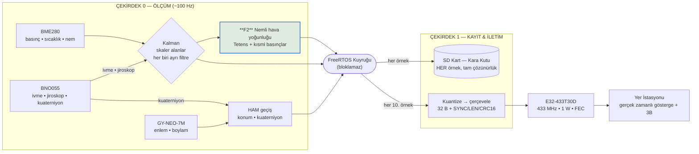

# Görev Yükü Bilimsel Görevi — Yazılım

## Görevin yazılım tarafındaki tanımı

Bilimsel görev yükünün (BGY) görevi, uçuş hattı boyunca atmosferin düşey profilini ölçmek ve bu profilden nemli hava yoğunluğunu türetmektir. Yazılım bu görevi üç fonksiyon üzerinden yerine getirir.

**F1 — Atmosferik durum ölçümü.** Mutlak basınç, hava sıcaklığı ve bağıl nem eş zamanlı ölçülür ve barometrik irtifa ile etiketlenir; böylece tek bir uçuştan yükseklik–basınç, yükseklik–sıcaklık ve yükseklik–nem profilleri elde edilir.

**F2 — Hava yoğunluğunun hesaplanması.** Ölçülen üçlüden nemli hava yoğunluğu, uçuş sırasında kart üzerinde hesaplanır. Yoğunluk doğrudan ölçülebilen bir büyüklük olmadığından, nem düzeltmesi içeren termodinamik bir modelle türetilir. Görev yükünün asıl bilimsel çıktısı budur: yoğunluk, sürükleme kuvvetini, itki verimini ve paraşüt iniş hızını belirleyen temel parametredir; elde edilen yükseklik–yoğunluk profili roketin uçuş performans analizinin doğrulanmasında kullanılır.

**F3 — Ölçüm bağlamının kayda geçirilmesi.** Bilimsel bir ölçüm, hangi konumda ve hangi hareket durumunda alındığı bilinmeden yorumlanamaz. Bu nedenle her ölçüm örneğine coğrafi konum (enlem/boylam) ile gövdenin hareket durumu (bileşke ivme, üç eksen dönüş hızı, yönelim kuaterniyonu) eşlik eder. Böylece ölçümün serbest düşüşte mi, paraşüt altında salınırken mi, yoksa dengede mi alındığı sonradan ayırt edilebilir ve salınım kaynaklı bozulmalar veri işleme aşamasında ayıklanabilir.

Görev yükü yazılımı **bilinçli olarak uçuş algoritması içermez**: durum makinesi, apoje tespiti ve ayrılma (fünye) sürüşü bulunmaz; bunlar uçuş kontrol bilgisayarının (UKB) sorumluluğundadır. Bu ayrım bir kısıt değil, güvenlik gerekçeli bir tasarım kararıdır — bilimsel ölçüm yazılımındaki bir hata hiçbir koşulda kurtarma sistemini tetikleyemez.

## Görevi yerine getiren yazılım mimarisi

Yazılım, ESP32'nin iki çekirdeğine bölünmüş, FreeRTOS tabanlı ve bloklamayan bir üretim/dağıtım hattı olarak kurulmuştur. Çekirdek 0 ölçüm, filtreleme ve bilimsel hesaptan; Çekirdek 1 kayıt ve iletimden sorumludur. İki çekirdek arasında yalnızca bir FreeRTOS kuyruğu bulunur; kuyruk doluysa örnek atlanır ve ölçüm döngüsü hiçbir koşulda beklemeye girmez.



**Ölçüm katmanı.** BME280 basınç/sıcaklık/nem sensörü I²C üzerinden, iki olası adreste (0x76 ve 0x77) otomatik aranarak başlatılır; böylece modül varyantı değişse bile yazılım değişikliği gerekmez. Sensör, basınç kanalı 16 kat aşırı örneklemeli ve donanımsal IIR filtresi açık olacak şekilde yapılandırılır — basınç, yoğunluk hesabının en baskın girdisi olduğundan en yüksek çözünürlükte okunur. BNO055 atalet ölçüm birimi füzyon modunda başlatılır; yer çekimi ayrıştırılmış doğrusal ivme, jiroskop ve yönelim kuaterniyonu okunur. GPS alıcısı UART2'den NMEA cümleleri olarak okunup ayrıştırılır. Ölçüm döngüsü 100 Hz hedefiyle çalışır; sensörlerin I²C okuma süresi eklendiğinde kart üzerinde ölçülen efektif hız ~65 Hz mertebesindedir. Bu, saniyede onlarca bilimsel örnek anlamına gelir ve atmosferik büyüklüklerin değişim hızına göre fazlasıyla yeterlidir.

**Filtreleme.** Filtreleme kararı alan bazında verilir: bir büyüklük ancak tek boyutlu, diğer alanlardan bağımsız, gürültülü ve sensör tarafından dahili olarak filtrelenmemiş bir ölçümse skaler Kalman filtresinden geçirilir. Basınç, sıcaklık, bağıl nem ile ivme ve jiroskop eksenleri bu koşulu sağlar ve her biri kendi bağımsız filtresine sahiptir. Barometrik irtifa ayrıca filtrelenmez, filtrelenmiş basınçtan türetilir; aksi hâlde aynı fiziksel büyüklüğün iki görünümü farklı zaman sabitleriyle yumuşatılır ve birbiriyle tutarsız iki alan üretilirdi. Buna karşılık GPS konumu ve yönelim kuaterniyonu **kasıtlı olarak ham iletilir**: alıcı ile IMU zaten kendi dahili kestirim çözümlerini üretir, üzerlerine ikinci bir filtre yeni bilgi katmaz yalnız gecikme bindirir; ayrıca hız durumu içermeyen skaler bir filtre gerçek hareketi gürültü sayarak bastırır ve kuaterniyon bileşenlerinin ayrı ayrı filtrelenmesi birim uzunluk kısıtını bozarak fiziksel olarak geçersiz bir yönelim üretir. Kurtarma amaçlı konum verisinde belirleyici ölçüt yumuşaklık değil doğruluktur.

**Yer kalibrasyonu.** Barometrik irtifanın anlamlı olması için kalkış noktasının basıncı bilinmelidir. Yazılım açılışta 20 basınç örneği alıp ortalamasını referans basınç olarak saklar ve tüm irtifa değerlerini bu referansa göre hesaplar. Böylece o günün hava durumundan bağımsız, kalkış noktasına göre yerden yükseklik elde edilir; sabit bir standart atmosfer değeri varsayılmaz.

## Bilimsel çıktı: nemli hava yoğunluğu

Yoğunluk, kuru hava ve su buharı ayrı ideal gazlar olarak ele alınıp kısmi yoğunlukların toplanmasıyla hesaplanır. Doymuş buhar basıncı Tetens bağıntısıyla bulunur:

```
es(T) = 6,1078 · 10^(7,5·T / (T + 237,3))              [hPa]   doymuş buhar basıncı
pv    = (RH/100) · es                                   [hPa]   kısmi buhar basıncı
pd    = p − pv                                          [hPa]   kuru havanın kısmi basıncı
ρ     = (pd·100)/(Rd·Tk) + (pv·100)/(Rv·Tk)             [kg/m³]
        Rd = 287,058   Rv = 461,495 J/(kg·K)   Tk = T + 273,15
```

Nem düzeltmesinin gerekliliği ölçülebilir bir farktır: su buharı kuru havadan hafif olduğundan nem yoğunluğu düşürür. Sıcak ve nemli bir günde (35 °C, %100 bağıl nem) nemin ihmal edilmesi yaklaşık %2 hata üretir; bu, sürükleme hesabında doğrudan görünen bir sapmadır. Sensör bağıl nem kanalını zaten içerdiğinden doğru olan, nemli hava modelinin kullanılmasıdır. Hesap filtrelenmiş girdiler üzerinden yapılır ve türetilmiş sonuca ikinci bir Kalman uygulanmaz. Fiziksel olarak imkânsız sensör çıktılarına karşı bağıl nem [0, 100] aralığına, kısmi buhar basıncı toplam basınca kırpılır ve sıfıra bölme korumaları uygulanır; böylece bozuk bir okuma negatif, sonsuz veya tanımsız yoğunluk üretemez.

## Veri ürünleri, kayıt ve iletim

Kuyruktan alınan **her** örnek tam çözünürlükte SD karta CSV olarak yazılır. Yazma doğrudan karta değil ping-pong tampon çiftine yapılır; tampon dolduğunda tek blokta basılır ve her 100 örnekte bir fiziksel `flush` ile kalıcılaştırılır, böylece kartın yazma gecikmesi ölçüm döngüsünü bloklamaz. Aynı paket her 10. örnekte sabit noktalı tam sayı biçimine dönüştürülüp (32 bayt faydalı yük) çerçevelenerek telsize verilir; çerçeve iki senkronizasyon baytı, uzunluk baytı, faydalı yük ve CRC16-CCITT'ten oluşur.

| Büyüklük | Fonksiyon | Havadan (~10 Hz) | SD kart (her örnek) |
|---|---|---|---|
| Basınç | F1 | ✓ 0,1 hPa | ✓ tam çözünürlük |
| Sıcaklık | F1 | ✓ 0,01 °C | ✓ tam çözünürlük |
| Bağıl nem | F1 | ✓ 0,01 % | ✓ tam çözünürlük |
| Barometrik irtifa | F1 | ✓ 0,1 m | ✓ tam çözünürlük |
| **Hava yoğunluğu** | **F2** | **✓ 0,001 kg/m³** | **✓ tam çözünürlük** |
| Doymuş / kısmi buhar basıncı (`es`, `pv`) | F2 ara değer | — | ✓ tam çözünürlük |
| GPS enlem / boylam | F3 | ✓ ~1 cm | ✓ tam çözünürlük |
| Bileşke ivme | F3 | ✓ 0,01 m/s² | ✓ tam çözünürlük |
| İvme X / Y / Z (ham eksenler) | F3 | — | ✓ tam çözünürlük |
| Yönelim kuaterniyonu | F3 | ✓ 10⁻⁴ | ✓ tam çözünürlük |
| Jiroskop X / Y / Z | F3 | ✓ 0,1 rad/s | ✓ tam çözünürlük |
| Zaman etiketi | tümü | — | ✓ ms çözünürlük |

Bant genişliği kısıtı nedeniyle havadan gitmeyen alanlar bilimsel analiz için gerekli olduğundan kara kutuda tam çözünürlükte tutulur; Tetens ara değerleri ayrıca basınç/sıcaklık/nem üçlüsünden yerde birebir yeniden türetilebildiğinden gönderilmemeleri bilgi kaybı değildir. Kara kutu dosyaları her uçuşta ayrı dosyaya yazılır (`gy_log.csv`, `gy_log1.csv`, …); açılışta ilk boş isim seçilir, böylece önceki denemenin verisi üzerine yazılmaz.

## Veri bütünlüğü ve arıza toleransı

Bilimsel çıktının korunması iki bağımsız kola dayanır. **Kayıt kolu:** telsiz bağlantısı tamamen kesilse dahi ölçümlerin tamamı SD kartta tam çözünürlükte kalır; telemetri uçuş anında izleme amacı taşır, bilimsel verinin kaynağı kara kutudur. Dolayısıyla görevin yerine getirilmesi RF menziline bağımlı değildir. **İletim kolu:** hat üzerindeki bit bozulmaları ve tampon kaymaları CRC16-CCITT ile tespit edilir; yer istasyonu doğrulanmayan paketi sessizce atar, böylece bozuk bir paket haritaya hatalı konum çizmez. Telsiz modülü kendi RF katmanında ayrıca CRC ve FEC uygular.

Kartın arazide bulunabilmesi — yani kara kutuya erişilebilmesi — kurtarma beacon'ı ile desteklenir. Beacon, `setup()`'ın en başında bağımsız bir FreeRTOS görevi olarak başlatılır; buzzer ve LED aynı zaman fazından beslenerek saniyede bir 200 ms boyunca senkron yanıp öter. Başlatma adımlarından hiçbiri (SD kart yokluğu, sensör bekleme, hata döngüsü) beacon'ı durduramaz.

Yazılım, tek bir bileşen arızasının tüm görevi düşürmemesi ilkesiyle yazılmıştır:

| Arıza | Yazılım davranışı | Bilimsel göreve etkisi |
|---|---|---|
| BME280 bulunamıyor | Teşhis mesajı yayınlanır, sistem durdurulur | Görev yapılamaz — sessizce hatalı veri üretmek yerine açıkça durulur |
| BNO055 bulunamıyor | Telemetri ve kayıt sürer; iniş tespiti yalnız barometreye düşer | F1 ve F2 tam çalışır, yalnız F3'ün hareket bağlamı eksilir |
| SD kart yok / açılamıyor | Ölçüm ve telemetri kesintisiz sürer | Kara kutu kaybı; veri yalnız telemetriden toplanır |
| GPS kilidi yok | Konum alanları son geçerli değerde kalır | F1 ve F2 etkilenmez |
| RF bağlantısı kesik | Kayıt kolu etkilenmez | Bilimsel veri tam korunur |
| Kuyruk dolu | Örnek atlanır, üretim döngüsü bloklanmaz | Örnekleme hızında geçici seyrelme; hat kilitlenmez |

Her başlatma adımının sonucu telsiz üzerinden teşhis mesajı olarak yayınlanır (hangi sensörün bulunduğu, ölçülen referans basınç, hangi log dosyasına yazıldığı). Böylece kart kapalı gövde içindeyken bile sistemin uçuşa hazır olup olmadığı yerden doğrulanabilir. Ayrıca üç durum LED'i, yapılandırma tamamlanana kadar 1 Hz yanıp sönerek, hazır olunduğunda sabit yanarak sistemin durumunu görsel olarak bildirir.

## Yer istasyonu tarafı

Yer istasyonu yazılımı gelen bayt akışında senkronizasyon baytlarını arar, uzunluk baytına göre faydalı yükü ayırır, CRC'yi doğrular ve yalnız geçerli paketleri işler; her alan kendi ölçeğine bölünerek mühendislik birimine döndürülür. Bilimsel görev açısından gerçek zamanlı olarak şunlar izlenir: hava yoğunluğu sayısal göstergesi; basınç, sıcaklık, nem ve irtifa zaman serisi grafikleri; konumun harita üzerinde ayrı iz olarak çizilmesi. Ayrıca hareket verisinden gerçek zamanlı 3B illüstrasyon üretilir — yönelim kuaterniyonundan sürülen dönen gövde modeli, yapay ufuk, yaw pusulası ve üç eksen dönüş hızı barları. Yönelim kuaterniyonla sürüldüğünden dik uçuşta Euler gösteriminin gimbal kilidi problemi oluşmaz. Tüm paketler yer istasyonunda ikinci bir CSV kopyası olarak da kaydedilir.

## Doğrulama ve yazılı teyit

Yazılımın görevi yerine getirebildiği aşağıdaki doğrulamalarla tespit edilmiştir.

**D1 — Derleme ve kaynak kullanımı.** Görev yükü yazılımı hedef donanım için (ESP32, `pio run -e gorevyuku`) hatasız derlenir. Bellek kullanımı: RAM %7,1 (327 680 baytın 23 156 baytı), Flash %28,0 (1 310 720 baytın 366 429 baytı) — her iki kaynakta da geniş pay mevcuttur.

**D2 — Yoğunluk hesabının doğruluğu.** Hesap, gömülü yazılımdaki kodun birebir kopyası ile bilinen referans koşullarda sınanmıştır:

| Koşul | Hesaplanan | Referans | Sonuç |
|---|---|---|---|
| 1013,25 hPa / 15 °C / %0 nem | 1,2250 kg/m³ | 1,2250 kg/m³ (ISA deniz seviyesi) | ✓ |
| 1013,25 hPa / 15 °C / %100 nem | 1,2172 kg/m³ | elle hesap 1,21716 kg/m³ | ✓ |
| Tetens `es`(15 °C) | 17,05 hPa | 17,04 hPa (literatür) | ✓ |
| 35 °C'de nem etkisi | %2,10 azalma | nem yoğunluğu düşürür | ✓ yön doğru |

**D3 — Sınır ve bozuk sensör koşulları.** Bağıl nem %250 ve −%30 verildiğinde sonuç sırasıyla %100 ve %0 koşullarına kırpılır; kısmi buhar basıncının toplam basıncı aştığı fiziksel olarak imkânsız durumda çıktı pozitif ve sonlu kalır; sensörün alt sıcaklık sınırında (−40 °C) sonuç sonlu, pozitif ve paket alanına sığar. Hiçbir koşulda tanımsız (`NaN`), sonsuz veya negatif yoğunluk üretilmez.

**D4 — Uçtan uca telemetri zinciri.** Gömülü yazılımın ürettiği sabit noktalı paket düzeni ile yer istasyonunun ayrıştırma düzeninin birebir örtüştüğü alan alan doğrulanmıştır: paket boyutu 32 bayt, tüm alanlar kuantizasyon çözünürlüğü içinde geri elde edilmekte, yoğunluk 0,0005 kg/m³, konum 10⁻⁷ derece (~1 cm), kuaterniyon 10⁻⁴ toleransıyla korunmaktadır. Bozulmuş CRC, hatalı uzunluk ve eski paket boyutu içeren çerçeveler reddedilmektedir.

**D5 — Kapalı çevrim simülasyon.** Yer istasyonu, gerçek uçuş kodundaki aynı ayrıştırma ve görselleştirme yolunu kullanan simülasyon modunda çalıştırılmış; geçerli çerçeveler üretilip ayrıştırılmış, yoğunluk fiziksel aralıkta, yönelim kuaterniyonu birim uzunlukta (|q| = 1,00000) ve 3B dönüş matrisi geçerli bir dönüş olarak (dikgen, determinant = 1) doğrulanmıştır.

**Teyit.** Yukarıdaki doğrulamalar ışığında, bilimsel görev yükü yazılımının tanımlanan görevi — atmosferin düşey profilini ölçmek, bu profilden nemli hava yoğunluğunu türetmek ve ölçümleri konum ve hareket bağlamıyla birlikte hem kart üzerinde kalıcı olarak kaydetmek hem de yer istasyonuna gerçek zamanlı iletmek — **yerine getirebildiği yazılı olarak teyit edilmektedir.** Bilimsel verinin kaynağı kart üzerindeki kara kutu olduğundan, görevin tamamlanması telsiz bağlantısının sürekliliğine bağımlı değildir.
