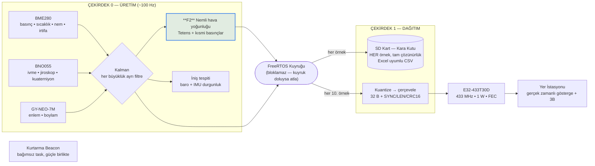

# Bilimsel Görev Yükü — Görev Tanımı ve Yazılım Yeterliliği

> Bu bölüm görev yükünün **yazılım** yönünü kapsar: bilimsel görevin ne olduğu, yazılımın bu görevi hangi mekanizmalarla yerine getirdiği ve görevin yerine getirilebileceğinin doğrulama kanıtlarıyla teyidi. Donanım, sensör tedariki ve mekanik yapı ayrı bölümlerde sunulmaktadır.

## 1. Bilimsel Görev Tanımı

Bilimsel görev yükünün (BGY) görevi, **uçuş boyunca atmosferin düşey profilini ölçmek ve bu profilden hava yoğunluğunu türetmektir.** Görev, yazılım açısından üç fonksiyona ayrılır:

**F1 — Atmosferik durum ölçümü.** Uçuş hattı boyunca mutlak basınç, hava sıcaklığı ve bağıl nem eş zamanlı olarak ölçülür ve barometrik irtifa ile etiketlenir. Böylece tek bir uçuştan yükseklik–basınç, yükseklik–sıcaklık ve yükseklik–nem profilleri elde edilir.

**F2 — Hava yoğunluğunun hesaplanması.** Ölçülen üçlüden (basınç, sıcaklık, bağıl nem) **nemli hava yoğunluğu** uçuş sırasında, kart üzerinde hesaplanır. Yoğunluk doğrudan ölçülebilen bir büyüklük değildir; nem düzeltmesi içeren bir termodinamik modelle türetilir. Bu, görev yükünün asıl bilimsel çıktısıdır: yoğunluk sürükleme kuvvetini, itki verimini ve paraşüt iniş hızını belirleyen temel parametredir; ölçülen yükseklik–yoğunluk profili roketin uçuş performans analizinin doğrulanmasında kullanılır.

**F3 — Ölçüm bağlamının kayda geçirilmesi.** Bilimsel bir ölçüm, hangi konumda ve hangi hareket durumunda alındığı bilinmediğinde yorumlanamaz. Bu nedenle her ölçüm örneğine coğrafi konum (GPS enlem/boylam) ile gövdenin hareket durumu (bileşke ivme, üç eksen dönüş hızı, yönelim kuaterniyonu) eşlik eder. Bu sayede ölçümün serbest düşüşte mi, paraşüt altında sallanırken mi, yoksa dengede mi alındığı sonradan ayırt edilebilir; sallanma kaynaklı ölçüm bozulmaları veri işleme aşamasında ayıklanabilir.

Görev yükü yazılımı **bilinçli olarak uçuş algoritması içermez** — durum makinesi, apogee tespiti ve ayrılma (fünye) sürüşü yoktur; bunlar uçuş kontrol bilgisayarının (UKB) sorumluluğundadır. Bu ayrım bir kısıt değil, tasarım kararıdır: bilimsel ölçüm yazılımındaki bir hata hiçbir koşulda kurtarma sistemini tetikleyemez.

## 2. Görevi Yerine Getiren Yazılım Mimarisi

Yazılım, ESP32'nin iki çekirdeğine bölünmüş, FreeRTOS tabanlı, bloklamayan bir üretim/dağıtım hattı olarak kurulmuştur.



### 2.1 Ölçüm katmanı

BME280 basınç/sıcaklık/nem sensörü I²C üzerinden, iki olası adreste (0x76 ve 0x77) otomatik aranarak başlatılır; böylece modül varyantı değişse bile yazılım değişikliği gerekmez. Sensör, basınç kanalı **16 kat aşırı örnekleme** ve donanımsal IIR filtresi açık olacak şekilde yapılandırılır — basınç, yoğunluk hesabının en baskın girdisi olduğu için en yüksek çözünürlükte okunur.

BNO055 atalet ölçüm birimi IMU füzyon modunda (`OPERATION_MODE_IMUPLUS`) başlatılır; yer çekimi ayrıştırılmış doğrusal ivme, jiroskop ve yönelim kuaterniyonu okunur. GPS alıcısı UART2'den NMEA cümleleri olarak okunup TinyGPS++ ile ayrıştırılır.

Ölçüm döngüsü 100 Hz hedefiyle çalışır. Sensörlerin I²C okuma süresi döngü periyoduna eklendiği için ölçülen efektif hız bunun altındadır (roket kartında yapılan ölçümde ~65 Hz mertebesi); bu, saniyede onlarca bilimsel örnek anlamına gelir ve atmosferik büyüklüklerin değişim hızına göre fazlasıyla yeterlidir.

### 2.2 Filtreleme

Havadan iletilen **her** büyüklük Kalman filtresinden geçer; pakete hiçbir ham ölçüm doğrudan yazılmaz. Her büyüklük kendi bağımsız filtresine sahiptir ve parametreleri o büyüklüğün fiziksel değişim hızına göre ayrı ayarlanmıştır: en yavaş değişen büyüklük olan sıcaklık en dar belirsizlikle, iniş sırasında hızlı değişen irtifa daha gevşek parametrelerle çalışır.

Konum verisi özel bir yaklaşım gerektirir. Kalman filtresi doğrudan derece cinsinden uygulandığında ardışık kestirim farkları (10⁻⁵ derece ≈ 1,1 m) süreç gürültüsünü besleyemeyecek kadar küçük kalır, kazanç söner ve **filtre ilk konum çözümünde donar.** Bu nedenle ilk geçerli çözüm referans alınır, filtreleme metre mertebesine ölçeklenmiş bir domende yapılır ve çıkış tekrar dereceye çevrilir; ayrıca filtre yalnızca yeni bir konum çözümü geldiğinde güncellenir. Ayrıntı için bkz. [Konum Belirleyici Mimari](rapor-konum-belirleyici-mimari.md).

### 2.3 Yer kalibrasyonu

Barometrik irtifanın anlamlı olması için kalkış noktasının basıncı bilinmelidir. Yazılım, açılışta 20 basınç örneği alıp ortalamasını **referans basınç** olarak saklar; tüm irtifa değerleri bu referansa göre hesaplanır. Böylece o günün hava durumundan bağımsız, kalkış noktasına göre yerden yükseklik elde edilir; sabit bir standart atmosfer değeri varsayılmaz.

### 2.4 Bilimsel çıktı: nemli hava yoğunluğu (F2)

Yoğunluk, kuru hava ve su buharı ayrı ideal gazlar olarak ele alınıp kısmi yoğunlukların toplanmasıyla hesaplanır. Doymuş buhar basıncı Tetens bağıntısıyla bulunur:

```
es(T) = 6,1078 · 10^(7,5·T / (T + 237,3))              [hPa]   doymuş buhar basıncı
pv    = (RH/100) · es                                   [hPa]   kısmi buhar basıncı
pd    = p − pv                                          [hPa]   kuru havanın kısmi basıncı
ρ     = (pd·100)/(Rd·Tk) + (pv·100)/(Rv·Tk)             [kg/m³]
        Rd = 287,058   Rv = 461,495 J/(kg·K)   Tk = T + 273,15
```

Nem düzeltmesinin gerekliliği ölçülebilir bir farktır: su buharı kuru havadan hafif olduğu için nem yoğunluğu **düşürür**. Sıcak ve nemli bir günde (35 °C, %100 bağıl nem) nemin ihmal edilmesi yaklaşık **%2** hata üretir — bu, sürükleme hesabında doğrudan görünen bir sapmadır. BME280 bağıl nem kanalını zaten içerdiğinden, doğru olan nemli hava modelinin kullanılmasıdır.

Hesap, filtrelenmiş girdiler üzerinden yapılır ve türetilmiş sonuca **ikinci bir Kalman uygulanmaz**; girdilerin üçü de filtreli olduğundan ek filtre yalnız gecikme bindirirdi. Fiziksel olarak imkânsız sensör çıktılarına karşı bağıl nem [0, 100] aralığına, kısmi buhar basıncı toplam basınca kırpılır ve sıfıra bölme korumaları uygulanır; böylece bozuk bir sensör okuması negatif veya sonsuz yoğunluk üretemez.

### 2.5 Kayıt ve iletim ayrımı

Kuyruktan alınan her örnek **tam çözünürlükte** SD karta CSV olarak yazılır. Yazma, doğrudan karta değil ping-pong tampon çiftine yapılır; tampon dolduğunda tek blokta karta basılır ve her 100 örnekte bir fiziksel `flush` ile kalıcılaştırılır. Böylece SD kartın yazma gecikmesi ölçüm döngüsünü bloklamaz.

Aynı paket, her 10. örnekte sabit noktalı tam sayı formatına dönüştürülüp (32 bayt faydalı yük) çerçevelenerek radyoya verilir. Çerçeveleme iki senkronizasyon baytı, uzunluk baytı, faydalı yük ve CRC16-CCITT'ten oluşur; UART'a yazma sürücünün halka tamponuna bırakılıp hemen dönüldüğü için gönderim süresi boyunca üretim döngüsü beklemez.

## 3. Veri Ürünleri

| Büyüklük | Fonksiyon | Havadan (10 Hz) | SD kart (her örnek) |
|---|---|---|---|
| Basınç | F1 | ✓ 0,1 hPa | ✓ tam çözünürlük |
| Sıcaklık | F1 | ✓ 0,01 °C | ✓ tam çözünürlük |
| Bağıl nem | F1 | ✓ 0,01 % | ✓ tam çözünürlük |
| Barometrik irtifa | F1 | ✓ 0,1 m | ✓ tam çözünürlük |
| **Hava yoğunluğu** | **F2** | **✓ 0,001 kg/m³** | **✓ tam çözünürlük** |
| Doymuş / kısmi buhar basıncı (`es`, `pv`) | F2 ara değer | — | ✓ tam çözünürlük |
| GPS enlem / boylam | F3 | ✓ ~1 cm | ✓ tam çözünürlük |
| Bileşke ivme | F3 | ✓ 0,01 m/s² | ✓ tam çözünürlük |
| İvme X / Y / Z (ham eksenler) | F3 | — | ✓ tam çözünürlük |
| Yönelim kuaterniyonu | F3 | ✓ 10⁻⁴ | ✓ tam çözünürlük |
| Jiroskop X / Y / Z | F3 | ✓ 0,1 rad/s | ✓ tam çözünürlük |
| Zaman etiketi | tümü | — | ✓ ms çözünürlük |

Bant genişliği kısıtı nedeniyle havadan gitmeyen alanlar (ham ivme eksenleri, Tetens ara değerleri) bilimsel analiz için gerekli olduğundan kara kutuda tam çözünürlükte tutulur. Tetens ara değerleri ayrıca basınç/sıcaklık/nem üçlüsünden yerde birebir yeniden türetilebilir; havadan gönderilmemeleri bilgi kaybı değildir.

Kara kutu dosyaları **her uçuşta ayrı dosyaya** yazılır (`gy_log.csv`, `gy_log1.csv`, …); açılışta ilk boş isim seçilir, böylece önceki denemenin verisi üzerine yazılmaz. Dosyalar başlık satırlı ve Excel'de doğrudan açılabilecek biçimdedir; ilk sütun milisaniye çözünürlüklü zaman etiketidir.

## 4. Veri Bütünlüğü

Görevin bilimsel çıktısının korunması iki bağımsız kola dayanır:

**Kayıt kolu.** Radyo bağlantısı tamamen kesilse dahi ölçümlerin tamamı kart üzerindeki SD kartta tam çözünürlükte kalır. Telemetri, uçuş anında izleme amacı taşır; **bilimsel verinin kaynağı kara kutudur.** Dolayısıyla görevin yerine getirilmesi RF menziline bağımlı değildir.

**İletim kolu.** UART hattındaki bit bozulmaları ve tampon kaymaları CRC16-CCITT ile tespit edilir; yer istasyonu CRC'si tutmayan paketi sessizce atar, böylece bozuk bir paket haritaya hatalı konum çizmez veya göstergede sıçrama yaratmaz. E32 modülü kendi RF katmanında ayrıca CRC ve FEC uygular; uygulama katmanındaki CRC ikinci bir koruma katmanıdır.

Kartın arazide bulunabilmesi — yani kara kutuya erişilebilmesi — kurtarma beacon'ı ile desteklenir. Beacon, `setup()`'ın en başında **bağımsız bir FreeRTOS task'ı** olarak başlatılır; buzzer ve LED aynı zaman fazından beslenerek saniyede bir 200 ms boyunca senkron yanıp öter. Başlatma adımlarından hiçbiri (SD kart yokluğu, sensör bekleme, hata döngüsü) beacon'ı durduramaz. Bu, bilimsel görev açısından doğrudan anlamlıdır: veri ancak kart geri alınabilirse kullanılabilir.

## 5. Arıza Toleransı

Yazılım, tek bir bileşen arızasının tüm görevi düşürmemesi ilkesiyle yazılmıştır:

| Arıza | Yazılım davranışı | Bilimsel göreve etkisi |
|---|---|---|
| BME280 bulunamıyor | Teşhis mesajı yayınlanır, sistem durdurulur | Görev yapılamaz — F1/F2 tümüyle bu sensöre bağlı; sessizce hatalı veri üretmek yerine açıkça durulur |
| BNO055 bulunamıyor | `bnoOk = false`, telemetri ve kayıt sürer; iniş tespiti yalnız barometreye düşer | F1 ve F2 tam çalışır, yalnız F3'ün hareket bağlamı eksilir |
| SD kart yok / açılamıyor | `sdOk = false`, ölçüm ve telemetri kesintisiz sürer | Kara kutu kaybı; veri yalnız telemetriden toplanır |
| GPS kilidi yok | Konum alanları son geçerli değerde kalır, diğer alanlar etkilenmez | F1 ve F2 etkilenmez |
| RF bağlantısı kesik | Kayıt kolu etkilenmez | Bilimsel veri tam korunur (bkz. §4) |
| Kuyruk dolu | Örnek atlanır, üretim döngüsü bloklanmaz | Örnekleme hızında geçici seyrelme; hat kilitlenmez |

Her başlatma adımının sonucu LoRa üzerinden teşhis mesajı olarak yayınlanır (hangi sensörün bulunduğu, ölçülen referans basınç, hangi log dosyasına yazıldığı). Böylece kart kapalı gövde içindeyken bile sistemin uçuşa hazır olup olmadığı yerden doğrulanabilir. Ayrıca üç durum LED'i, yapılandırma tamamlanana kadar 1 Hz yanıp sönerek, hazır olunduğunda sabit yanarak sistemin durumunu görsel olarak bildirir.

## 6. Yer İstasyonu Tarafı

Yer istasyonu yazılımı gelen bayt akışında senkronizasyon baytlarını arar, uzunluk baytına göre faydalı yükü ayırır, CRC'yi doğrular ve yalnız geçerli paketleri işler. Her alan kendi ölçeğine bölünerek mühendislik birimine döndürülür.

Bilimsel görev açısından yer istasyonunda şunlar gerçek zamanlı izlenir: hava yoğunluğu sayısal göstergesi; basınç, sıcaklık, nem ve irtifa zaman serisi grafikleri; konumun harita üzerinde ayrı iz olarak çizilmesi. Ayrıca gövdenin hareket verisinden **gerçek zamanlı 3B illüstrasyon** üretilir: yönelim kuaterniyonundan sürülen dönen 3B gövde modeli, yanında yapay ufuk ile yaw pusulası ve üç eksen dönüş hızı barları. Yönelim kuaterniyonla sürüldüğü için dik uçuşta Euler gösteriminin gimbal lock problemi oluşmaz. Tüm paketler ayrıca yer istasyonunda ikinci bir CSV kopyası olarak kaydedilir.

## 7. Doğrulama ve Yazılı Teyit

Yazılımın görevi yerine getirebildiği aşağıdaki doğrulamalarla tespit edilmiştir:

**D1 — Derleme.** Görev yükü yazılımı hedef donanım için (ESP32, `pio run -e gorevyuku`) hatasız derlenir. Bellek kullanımı: RAM %7,1 (327 680 baytın 23 244 baytı), Flash %28,3 (1 310 720 baytın 371 097 baytı) — her iki kaynakta da geniş pay mevcuttur.

**D2 — Yoğunluk hesabının doğruluğu.** Hesap, firmware'deki kodun birebir kopyası ile bilinen referans koşullarda sınanmıştır:

| Koşul | Hesaplanan | Referans | Sonuç |
|---|---|---|---|
| 1013,25 hPa / 15 °C / %0 nem | 1,2250 kg/m³ | 1,2250 kg/m³ (ISA deniz seviyesi) | ✓ |
| 1013,25 hPa / 15 °C / %100 nem | 1,2172 kg/m³ | elle hesap 1,21716 kg/m³ | ✓ |
| Tetens `es`(15 °C) | 17,05 hPa | 17,04 hPa (literatür) | ✓ |
| 35 °C'de nem etkisi | %2,10 azalma | nem yoğunluğu düşürür | ✓ yön doğru |

**D3 — Sınır ve bozuk sensör koşulları.** Bağıl nem %250 ve −%30 verildiğinde sonuç sırasıyla %100 ve %0 koşullarına kırpılır; kısmi buhar basıncının toplam basıncı aştığı fiziksel olarak imkânsız durumda çıktı pozitif ve sonlu kalır; BME280'in alt sıcaklık sınırında (−40 °C) sonuç sonlu, pozitif ve paket alanına sığar. Hiçbir koşulda `NaN`, sonsuz veya negatif yoğunluk üretilmez.

**D4 — Uçtan uca telemetri zinciri.** Firmware'in ürettiği sabit noktalı paket düzeni ile yer istasyonunun ayrıştırma düzeninin birebir örtüştüğü, alan alan doğrulanmıştır: paket boyutu 32 bayt, tüm alanlar kuantizasyon çözünürlüğü içinde geri elde edilir, yoğunluk 0,0005 kg/m³ toleransıyla, konum 10⁻⁷ derece (~1 cm) toleransıyla, kuaterniyon 10⁻⁴ toleransıyla korunur. Bozulmuş CRC, hatalı uzunluk ve eski paket boyutu içeren çerçeveler reddedilir.

**D5 — Kapalı çevrim simülasyon.** Yer istasyonu, gerçek uçuş kodundaki aynı ayrıştırma ve görselleştirme yolunu kullanan simülasyon modunda çalıştırılmış; her iki gövde için geçerli çerçeveler üretilip ayrıştırılmış, yoğunluk fiziksel aralıkta, yönelim kuaterniyonu birim uzunlukta (|q| = 1,00000) ve 3B dönüş matrisi geçerli bir dönüş olarak (dikgen, determinant = 1) doğrulanmıştır.

**Teyit.** Yukarıdaki doğrulamalar ışığında, bilimsel görev yükü yazılımının §1'de tanımlanan görevi — atmosferin düşey profilini ölçmek, bu profilden nemli hava yoğunluğunu türetmek ve ölçümleri konum ve hareket bağlamıyla birlikte hem kart üzerinde kalıcı olarak kaydetmek hem de yer istasyonuna gerçek zamanlı iletmek — **yerine getirebildiği teyit edilmektedir.** Bilimsel verinin kaynağı kart üzerindeki kara kutu olduğundan, görevin tamamlanması radyo bağlantısının sürekliliğine bağımlı değildir.

---

**İlgili bölümler:** [Konum Belirleyici Mimari ve Yer İstasyonu Veri Alışverişi](rapor-konum-belirleyici-mimari.md) · [Haberleşme Testi — Veri Paketi Yapısı](rapor-haberlesme-veri-paketi.md)
