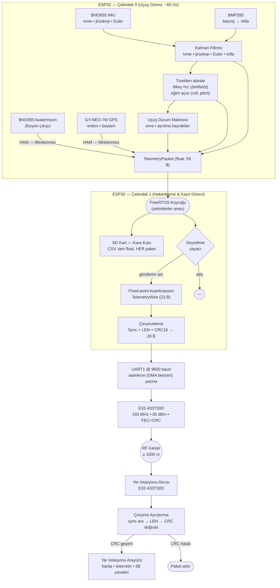
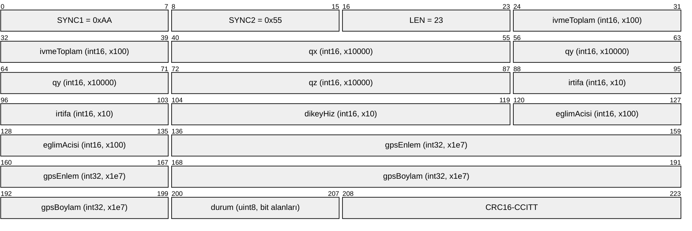

# Haberleşme Testi — Veri Paketi Yapısı

## Nihai Haberleşme Sistemi

Özgün UKB üzerinde haberleşme, ESP32'nin UART1 hattına bağlı **E32-433T30D (SX1278 tabanlı, 433 MHz, 30 dBm)** LoRa modülü ile sağlanmaktadır. Modül 9600 baud UART hızında, şeffaf (transparan) modda çalışacak şekilde uçuş öncesinde kalıcı olarak yapılandırılır; kanal, adres ve hava hızı parametreleri her açılışta yazılım tarafından modüle yeniden yüklenerek yer istasyonu ile UKB'nin aynı RF konfigürasyonunda olması garanti altına alınır. Aynı RF ve pin konfigürasyonu, yer istasyonu tarafındaki alıcı modülde de birebir kullanılmaktadır.

Telemetri gönderimi, uçuş kontrol algoritmasını bloklamayacak biçimde tasarlanmıştır. Sensör okuma ve uçuş durum makinesi ESP32'nin bir çekirdeğinde, haberleşme ve kayıt işlemleri diğer çekirdeğinde çalışır; iki çekirdek arasındaki veri aktarımı FreeRTOS kuyruğu üzerinden yapılır. LoRa'ya yazma işlemi ESP-IDF UART sürücüsünün halka tamponuna asenkron (DMA benzeri) olarak bırakılır, böylece gönderim süresi boyunca uçuş döngüsü beklemez.

## Veri Paketi Tasarımı

Havadan iletilen paket, bant genişliğini verimli kullanmak amacıyla **ondalık (float) değil, sabit noktalı (fixed-point) tam sayı** formatındadır. Uçuş bilgisayarı içinde 59 baytlık tam çözünürlüklü float paket üretilir; bu paketin tamamı SD karta kara kutu kaydı olarak yazılırken, yer istasyonuna yalnızca gerekli alanlar ölçeklenip tam sayıya dönüştürülerek **23 baytlık faydalı yük (payload)** halinde gönderilir. Bu dönüşüm sırasında her alan kendi ölçeğiyle çarpılır, yuvarlanır ve tam sayı sınırlarına kırpılır; taşma (overflow) oluşması engellenmiştir.

Faydalı yük, iletim öncesinde çerçevelenir. Çerçeve; iki senkronizasyon baytı, uzunluk baytı, 23 baytlık veri alanı ve 16 bitlik CRC'den oluşur ve **toplam 28 bayttır**:

```
[0xAA][0x55][LEN=23][TelemetryWire : 23 bayt][CRC16_HI][CRC16_LO]
```

Senkronizasyon baytları, yer istasyonunun bayt akışı içinde paket başlangıcını kaymadan yakalamasını sağlar. CRC16-CCITT (polinom 0x1021, başlangıç 0xFFFF) yalnızca 23 baytlık faydalı yük üzerinden hesaplanır; alıcı tarafta yeniden hesaplanarak karşılaştırılır ve uyuşmayan paketler atılır. E32 modülü kendi RF katmanında ayrıca CRC ve FEC uygulamaktadır; uygulama katmanındaki bu CRC, UART hattındaki bozulmalara ve tampon kaymalarına karşı ikinci bir koruma katmanıdır.

Paket içeriğinde **konum bilgisi zorunlu alan olarak yer almaktadır**: GPS enlem ve boylam, 1e7 ölçeğiyle 32 bit tam sayı olarak iletilir; bu çözünürlük yaklaşık 1 cm'lik konum hassasiyetine karşılık gelir ve GPS modülünün doğruluğunun çok üzerindedir, dolayısıyla kuantizasyondan kaynaklanan bir konum kaybı yoktur.

Yönelim bilgisi Euler açıları yerine **kuaterniyon** olarak gönderilir. Kuaterniyonun x, y, z bileşenleri 10000 ölçeğiyle iletilir; w bileşeni birim kuaterniyon koşulundan `w = √(1 − x² − y² − z²)` şeklinde yer istasyonunda geri hesaplanır. Bu sayede hem bir alan tasarrufu sağlanmış hem de dik uçuş sırasında Euler gösteriminde ortaya çıkan gimbal lock problemi tamamen ortadan kaldırılmıştır. Benzer şekilde üç eksen ivme ayrı ayrı gönderilmek yerine bileşke ivme büyüklüğü (`√(ax²+ay²+az²)`) tek alanda iletilir; ham eksen verileri ve jiroskop verileri tam çözünürlükte SD kart kaydında saklanır.

Kurtarma sistemi ve uçuş evresi bilgisi tek bir durum baytında bit alanları halinde paketlenmiştir; bu bayt sayesinde ayrılma komutlarının gerçekleşip gerçekleşmediği ve roketin hangi uçuş fazında olduğu tek bakışta yer istasyonunda izlenebilmektedir.

### Paket Alanları (23 bayt faydalı yük, little-endian)

| Ofset | Alan | Tip | Ölçek | Filtreleme | Birim / Açıklama |
|---|---|---|---|---|---|
| 0–1 | `ivmeToplam` | int16 | ×100 | **Kalman** (bileşen bazında) | m/s² — bileşke ivme büyüklüğü |
| 2–3 | `qx` | int16 | ×10000 | **Ham** (BNO055 füzyon çıkışı) | Kuaterniyon x bileşeni |
| 4–5 | `qy` | int16 | ×10000 | **Ham** (BNO055 füzyon çıkışı) | Kuaterniyon y bileşeni |
| 6–7 | `qz` | int16 | ×10000 | **Ham** (BNO055 füzyon çıkışı) | Kuaterniyon z bileşeni |
| 8–9 | `irtifa` | int16 | ×10 | **Kalman** (doğrudan) | m — barometrik irtifa |
| 10–11 | `dikeyHiz` | int16 | ×10 | **Kalman** (dolaylı — türev) | m/s — dikey hız (+ yükseliş / − iniş) |
| 12–13 | `eglimAcisi` | int16 | ×100 | **Kalman** (dolaylı — roll/pitch) | ° — düşeyden sapma açısı |
| 14–17 | `gpsEnlem` | int32 | ×10⁷ | **Ham** (GPS çözümü) | ° — **konum bilgisi (zorunlu alan)** |
| 18–21 | `gpsBoylam` | int32 | ×10⁷ | **Ham** (GPS çözümü) | ° — **konum bilgisi (zorunlu alan)** |
| 22 | `durum` | uint8 | — | — (mantıksal bayrak) | bit0: Ayrılma-1, bit1: Ayrılma-2, bit2–4: uçuş evresi |

Uçuş evresi kodları: `0 = Hazır`, `1 = Yükseliyor`, `2 = İniş-1 (birinci kurtarma)`, `3 = İniş-2 (ikinci kurtarma)`, `4 = İndi`.

### Filtreleme Politikası

Pakette taşınan alanların bir kısmı Kalman filtresinden geçmiş, bir kısmı ise bilinçli olarak ham bırakılmıştır. Bu ayrım rastgele değildir; her alan için filtrelemenin fayda mı yoksa zarar mı getirdiğine göre belirlenmiştir.

**Doğrudan Kalman'lanan alanlar.** Barometrik irtifa, tek boyutlu ve gürültülü bir skaler ölçüm olduğundan doğrudan Kalman filtresinden geçirilir. İrtifa, apogee tespitinin ve dolayısıyla kurtarma sistemi tetiklemesinin temel girdisi olduğu için filtre parametreleri özellikle bu alan için ayrıca ayarlanmıştır. İvmeölçer ve jiroskopun üç ekseni de kendi bağımsız Kalman filtrelerinden geçirilir; havadan gönderilen bileşke ivme büyüklüğü, bu **filtrelenmiş** eksen değerlerinden hesaplanır.

**Dolaylı olarak Kalman'lanan alanlar.** Dikey hız ve eğim açısı için ayrı bir filtre çalıştırılmaz; ancak her ikisi de girdisini filtrelenmiş büyüklüklerden aldığı için sonuç dolaylı olarak filtrelenmiş olur. Dikey hız, Kalman'dan geçmiş ardışık irtifa değerlerinin zamana göre farkı olarak hesaplanır — yani üzerine ikinci bir filtre uygulanmaz, gürültü bastırma tamamen irtifa filtresinden gelir. Eğim açısı ise Kalman'lanmış roll ve pitch açılarından türetilir. Bu türetmede, filtre çıkışındaki küçük sayısal taşmaların ters kosinüs fonksiyonunu tanımsız hale getirmemesi için değer aralığı ayrıca sınırlandırılmıştır.

**Bilinçli olarak ham bırakılan alanlar.** Yönelim kuaterniyonunun bileşenleri **kasıtlı olarak filtrelenmez**. Kuaterniyon bileşenleri birbirinden bağımsız değildir; birim uzunluk kısıtıyla birbirine bağlıdır. Her bileşeni ayrı ayrı skaler bir Kalman filtresinden geçirmek bu kısıtı bozar ve fiziksel olarak geçersiz bir yönelim üretir. Bu nedenle kuaterniyon, BNO055'in kendi dahili sensör füzyon çıkışından alındığı haliyle — yalnızca işaret normalizasyonu uygulanarak — gönderilir. Zaten modülün kendi füzyon algoritması ivmeölçer, jiroskop ve manyetometreyi birleştirdiğinden, çıkış halihazırda filtrelenmiş bir kestirimdir. GPS enlem ve boylamı da ham iletilir: GPS alıcısı kendi içinde zaten konum çözümü üretmektedir ve kurtarma amaçlı konum verisinde yumuşatma yerine gerçek ölçümün korunması tercih edilmiştir.

Kara kutu kaydında ise filtrelenmiş ivme ve jiroskop eksenleri ile Euler açıları (roll/pitch/yaw) tam çözünürlükte ayrıca saklanır; bu alanlar bant genişliği nedeniyle havadan gönderilmez, uçuş sonrası analizde kullanılır.

Yer istasyonu tarafında faydalı yük, `<7h2iB` yapı formatı ile tek adımda çözülür; her alan kendi ölçeğine bölünerek mühendislik birimine geri döndürülür.

## Gönderim Kadansı ve Bant Genişliği

Uçuş kontrol döngüsü yaklaşık 65 Hz'te çalışmakta ve her döngüde bir telemetri paketi üretilmektedir. Bu paketlerin tamamı SD karta yazılırken, LoRa üzerinden belirli bir oranda seyreltilerek gönderilir; böylece 9600 baud'luk hattın ve modülün ölçülen efektif hava kapasitesinin (~330 B/s) altında kalınır. Seyreltme oranı, hem yarışma şartnamesindeki minimum telemetri frekansını sağlayacak hem de CRC hatasına yol açacak doygunluğa girmeyecek şekilde seçilmiştir.

## Veri Akış Diyagramı



## Çerçeve Bayt Yerleşimi



Toplam çerçeve uzunluğu: **28 bayt** (3 bayt başlık + 23 bayt faydalı yük + 2 bayt CRC).
