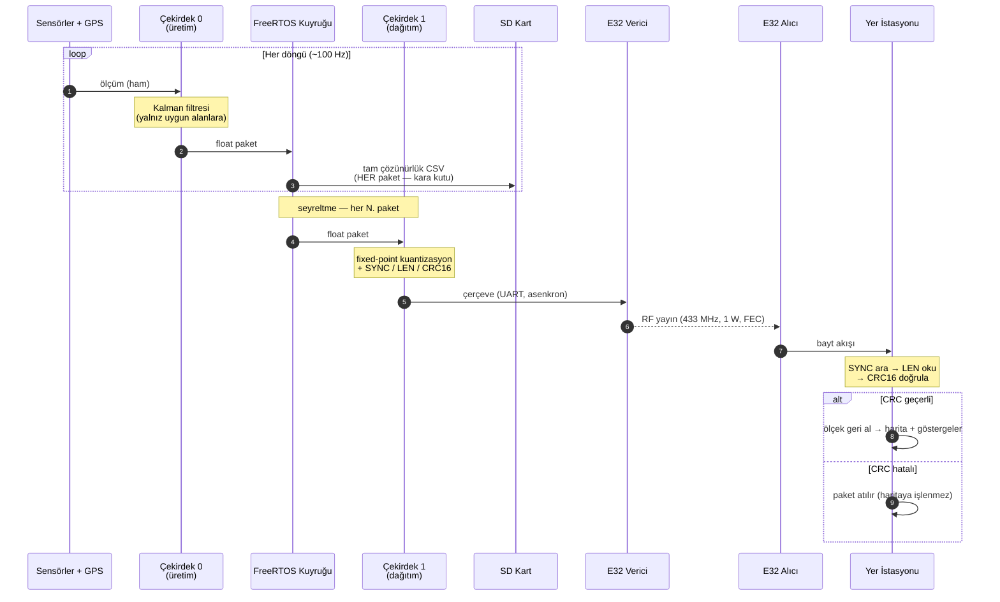
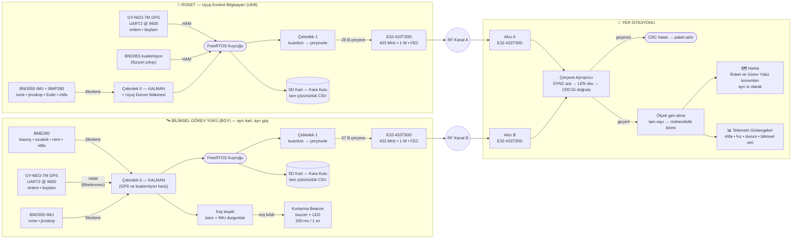
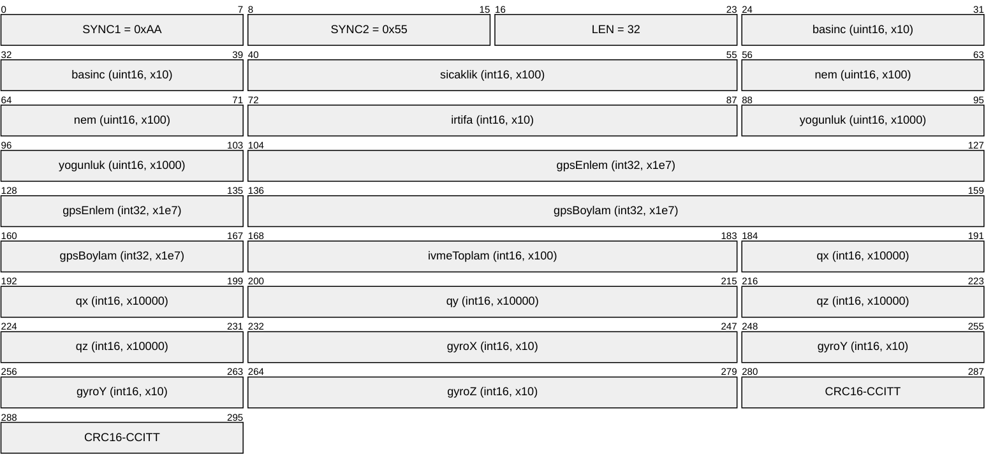
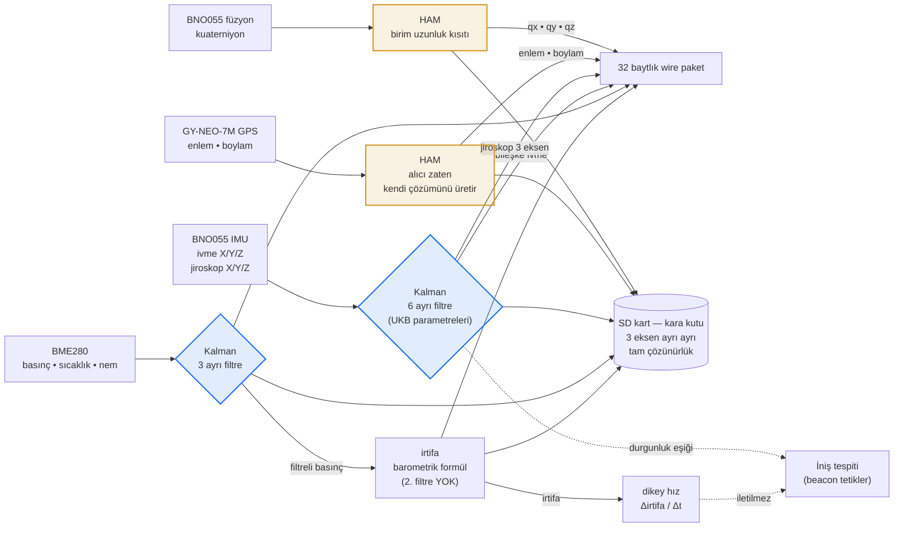

# Konum Belirleyici Sistemler ve Yer İstasyonu Veri Alışveriş Mimarisi

## Genel Yaklaşım

Roket ve bilimsel görev yükü, uçuş sırasında ayrılarak birbirinden bağımsız iki gövde olarak yere iner. Bu nedenle her iki gövde de **kendi kartı, kendi güç kaynağı, kendi GPS alıcısı ve kendi radyo vericisi** ile donatılmıştır. İki sistem arasında hiçbir kablolu bağlantı veya birbirine bağımlılık yoktur; ayrılma sonrası her gövde konumunu yer istasyonuna bağımsız olarak yayınlamaya devam eder. Böylece bir gövdedeki arıza, diğerinin bulunmasını engellemez.

Her iki sistemde de aynı donanım ailesi kullanılmıştır:

| | Roket (Uçuş Kontrol Bilgisayarı — UKB) | Bilimsel Görev Yükü (BGY) |
|---|---|---|
| Kart | Özgün UKB kartı (ESP32) | Ayrı, bağımsız BGY kartı (ESP32) |
| Konum alıcısı | GY-NEO-7M GPS, UART2 @ 9600 baud | GY-NEO-7M GPS, UART2 @ 9600 baud |
| Radyo vericisi | E32-433T30D (SX1278), 30 dBm / 1 W | E32-433T30D (SX1278), 30 dBm / 1 W |
| Veri hattı | UART1 @ 9600 baud, asenkron (DMA benzeri) | UART1 @ 9600 baud, asenkron (DMA benzeri) |
| Faydalı yük | 23 bayt (uçuş telemetrisi + konum) | 32 bayt (bilimsel veri + konum) |
| Çerçeve | 28 bayt (SYNC + LEN + veri + CRC16) | 37 bayt (SYNC + LEN + veri + CRC16) |
| Yedek kayıt | SD kart, CSV kara kutu | SD kart, CSV kara kutu |
| Kurtarma işareti | — | İniş sonrası sesli + ışıklı beacon (buzzer + LED) |

## Konum Belirleyiciler

**Birincil konum belirleyici (GPS):** Her iki kartta da GY-NEO-7M modülü UART2 üzerinden okunur; NMEA cümleleri TinyGPS++ kütüphanesi ile ayrıştırılarak enlem ve boylam elde edilir. Konum, telemetri paketinde **10⁷ ölçeğiyle 32 bit tam sayı** olarak taşınır. Bu çözünürlük yaklaşık 1 cm'ye karşılık gelir; yani kuantizasyondan kaynaklanan hiçbir konum kaybı olmaz, hassasiyeti belirleyen tek etken GPS alıcısının kendi doğruluğudur.

**İkincil konum belirleyici (radyo vericisi):** E32-433T30D modülleri 1 W çıkış gücünde ve FEC açık olarak yapılandırılmıştır. GPS kilidi kaybolsa dahi bu modüller telemetri yayınına devam ettiğinden, yer istasyonunda alınan sinyal gücü ve yönlü anten ile kaba yön kestirimi yapılabilir. Modül parametreleri (adres, kanal, hava hızı, güç, FEC) her açılışta yazılım tarafından modüle yeniden yüklenir; böylece hem havadaki hem yerdeki modülün aynı RF konfigürasyonunda olduğu garanti altına alınır.

**Kurtarma beacon'ı (görev yükü):** Görev yükü kartı, iniş tespitinden sonra kilitlenen (latch) bir kurtarma modu içerir. Bu modda buzzer ve gösterge LED'lerinin tamamı aynı zaman fazından beslenerek saniyede bir, 200 ms süreyle senkron olarak yanıp öter. Bu sayede görev yükü, arazide görsel ve işitsel olarak da bulunabilir; radyo menzilinin dışında kalınan son metrelerde arama ekibine yön verir.

## Yer İstasyonu ile Veri Alışveriş Mimarisi

Veri akışı, her iki gövdede de aynı iki aşamalı mimariyle çalışır:

**1. Üretim (ESP32 Çekirdek 0).** Sensörler ve GPS okunur. Filtreleme alan bazında uygulanır: yalnızca skaler Kalman filtresinin varsayımlarını karşılayan büyüklükler filtreden geçirilir, **konum ve yönelim kuaterniyonu kasıtlı olarak ham bırakılır** (gerekçe: §Filtreleme Politikası). Tüm alanlar tam çözünürlükte bir yapıya doldurulur — enlem ve boylam `double`, diğer alanlar `float`; konumun `float`'ta taşınması 41° civarında ~42 cm çözünürlük kaybı demek olurdu. Bu yapı bir FreeRTOS kuyruğuna bırakılır.

**2. Dağıtım (ESP32 Çekirdek 1).** Kuyruktan alınan her paket, tam çözünürlükte SD karta CSV olarak yazılır (kara kutu). Aynı paket, belirli bir seyreltme oranında sabit noktalı (fixed-point) tam sayı formatına dönüştürülüp çerçevelenerek LoRa'ya verilir. Çerçeveleme; iki senkronizasyon baytı, uzunluk baytı, faydalı yük ve CRC16-CCITT'ten (polinom 0x1021, başlangıç 0xFFFF) oluşur. UART'a yazma işlemi sürücünün halka tamponuna bırakılıp hemen dönüldüğü için, gönderim süresi boyunca veri üretim döngüsü bloklanmaz.

Bu ayrım kritik öneme sahiptir: **RF bağlantısı tamamen kesilse bile konum ve bilimsel verinin tamamı kart üzerindeki SD kartta tam çözünürlükte kayıtlı kalır.** Yani kurtarma sonrası veri kaybı yaşanmaz; telemetri, uçuş anında izleme amacı taşır.

Yer istasyonu tarafında her gövde için bir E32-433T30D alıcı modülü bulunur. Yer istasyonu yazılımı gelen bayt akışında senkronizasyon baytlarını arar, uzunluk baytına göre faydalı yükü ayırır, CRC'yi yeniden hesaplayarak doğrular ve yalnızca doğrulanan paketleri işler. Doğrulanan paketteki her alan kendi ölçeğine bölünerek mühendislik birimine geri döndürülür; enlem/boylam doğrudan harita katmanına, diğer alanlar telemetri göstergelerine ve 3B yönelim görselleştirmesine beslenir. CRC'si tutmayan paketler sessizce atılır, böylece bozuk bir paketin haritada hatalı konum çizmesi engellenir.

Roket ve görev yükü aynı anda yayın yaptığından, iki sistem **farklı LoRa kanallarında** çalışacak şekilde ayrılır (modülde taşıyıcı frekans `410 + kanal numarası` MHz formülüyle belirlenir). Bu ayrım sayesinde iki yayın birbirini bozmaz ve yer istasyonunda iki bağımsız veri akışı eş zamanlı olarak izlenebilir.

Tek bir paketin üretiminden yer istasyonunda haritaya işlenmesine kadar geçen alışveriş sırası aşağıdaki gibidir:



Diyagramda görüldüğü üzere SD kart kaydı ile RF yayını birbirinden bağımsız kollardır: RF tarafında paket kaybı yaşansa dahi kayıt kolu etkilenmez.

## Mimari Diyagram



## Görev Yükü Paket Alanları (32 bayt faydalı yük, little-endian)

| Ofset | Alan | Tip | Ölçek | Filtreleme | Birim / Açıklama |
|---|---|---|---|---|---|
| 0–1 | `basinc` | uint16 | ×10 | **Kalman** (doğrudan) | hPa |
| 2–3 | `sicaklik` | int16 | ×100 | **Kalman** (doğrudan) | °C |
| 4–5 | `nem` | uint16 | ×100 | **Kalman** (doğrudan) | % bağıl nem |
| 6–7 | `irtifa` | int16 | ×10 | Filtreli basınçtan türetilir | m — barometrik irtifa |
| 8–9 | `yogunluk` | uint16 | ×1000 | filtreli girdilerden türetilir | kg/m³ — **nemli hava yoğunluğu** |
| 10–13 | `gpsEnlem` | int32 | ×10⁷ | **Ham** (kasıtlı — bkz. §Konum) | ° — **konum bilgisi** |
| 14–17 | `gpsBoylam` | int32 | ×10⁷ | **Ham** (kasıtlı — bkz. §Konum) | ° — **konum bilgisi** |
| 18–19 | `ivmeToplam` | int16 | ×100 | **Kalman** (bileşen bazında) | m/s² — bileşke ivme |
| 20–21 | `qx` | int16 | ×10000 | BNO055 füzyon | yönelim kuaterniyonu |
| 22–23 | `qy` | int16 | ×10000 | BNO055 füzyon | yönelim kuaterniyonu |
| 24–25 | `qz` | int16 | ×10000 | BNO055 füzyon | yönelim kuaterniyonu |
| 26–27 | `gyroX` | int16 | ×10 | **Kalman** (doğrudan) | rad/s |
| 28–29 | `gyroY` | int16 | ×10 | **Kalman** (doğrudan) | rad/s |
| 30–31 | `gyroZ` | int16 | ×10 | **Kalman** (doğrudan) | rad/s |

Havadan iletilen alanların çoğu Kalman filtresinden geçmiş değerlerdir; **konum (enlem/boylam) ve yönelim kuaterniyonu ise kasıtlı olarak ham iletilir** — her ikisi de skaler Kalman filtresinin varsayımlarını karşılamaz (gerekçe: §Konum ve §Yönelim). Yoğunluk, filtrelenmiş basınç/sıcaklık/nem üçlüsünden hesaplanır; türetilmiş değere ikinci bir filtre uygulanmaz (yalnız gecikme bindirirdi).

Kuaterniyonun `w` bileşeni gönderilmez: uçuş bilgisayarı `w ≥ 0` olacak şekilde işaret normalizasyonu yaptığından yer istasyonu `w = √(1 − x² − y² − z²)` ile tek anlamlı geri hesaplar. Böylece hem bir alan tasarrufu sağlanır hem de dik uçuşta Euler gösteriminin gimbal lock problemi tamamen ortadan kalkar.

Çerçeve: `[0xAA][0x55][LEN=32][32 bayt faydalı yük][CRC16_HI][CRC16_LO]` = **37 bayt**.
Yer istasyonu ayrıştırma formatı: `<HhHhH2i7h`.

### Görev Yükü Çerçeve Bayt Yerleşimi



Toplam çerçeve uzunluğu: **37 bayt** (3 bayt başlık + 32 bayt faydalı yük + 2 bayt CRC).

### Hava Yoğunluğu Hesabı

Görev yükü, BME280'in basınç/sıcaklık/nem üçlüsünden **nemli hava** yoğunluğunu uçuş sırasında kendisi hesaplar ve sonucu havadan iletir:

```
es(T) = 6.1078 · 10^(7.5·T / (T + 237.3))     [hPa]   Tetens, doymuş buhar basıncı
pv    = (RH/100) · es                          [hPa]   kısmi buhar basıncı
pd    = p − pv                                 [hPa]   kuru hava kısmi basıncı
ρ     = (pd·100)/(287.058·Tk) + (pv·100)/(461.495·Tk)  [kg/m³],  Tk = T + 273.15
```

Kuru hava ve su buharı ayrı ideal gazlar olarak ele alınır; nem ihmal edilseydi sıcak-nemli bir günde yaklaşık %2 hata oluşurdu. Doğrulama: 1013.25 hPa / 15 °C / %0 bağıl nem → 1.2250 kg/m³ (ISA deniz seviyesi değeri), aynı koşulda %100 nem → 1.2172 kg/m³.

Tetens ara değerleri (`es`, `pv`) havadan **gönderilmez** — basınç, sıcaklık ve nem zaten pakette olduğundan yerde birebir türetilebilirler; görev yükünün SD kartında tam çözünürlükte kayıtlıdırlar.

## Filtreleme Politikası

Görev yükünde filtreleme **alan bazında** karara bağlanmıştır: bir büyüklük ancak skaler Kalman filtresinin varsayımlarını (tek boyutlu, diğerlerinden bağımsız, gürültülü, dahili olarak filtrelenmemiş ölçüm) karşılıyorsa filtrelenir. Bu koşulu sağlayan büyüklükler kendi bağımsız filtrelerine sahiptir ve parametreleri o büyüklüğün fiziksel değişim hızına göre ayrı ayrı ayarlanmıştır; sağlamayanlar (**konum ve yönelim**) kasıtlı olarak ham iletilir. SD kart kaydı da pakete giren değerlerin aynısını, ancak kuantize edilmemiş tam çözünürlükte tutar; kayıt ile telemetri arasındaki tek fark çözünürlük ve alan sayısıdır, filtreleme yaklaşımı ikisinde de aynıdır.

**Çevresel büyüklükler (BME280).** Basınç, sıcaklık ve bağıl nem, her biri kendi filtresinden geçer. Bu büyüklükler tek boyutlu, birbirinden bağımsız ve gürültülü skaler ölçümler olduğundan skaler Kalman filtresi için doğrudan uygundur.

**Barometrik irtifa için ayrı filtre yoktur; filtrelenmiş basınçtan türetilir.** Basınç ve irtifa aynı fiziksel büyüklüğün iki görünümüdür — irtifa okuma fonksiyonu içeride basıncı yeniden ham okuyup barometrik formülü uygular. İkisini birbirinden bağımsız iki filtreden geçirmek, farklı zaman sabitleriyle yumuşatılmış ve **birbiriyle tutarsız** iki alan üretiyordu: yerde `basinc` alanından `irtifa` alanını geri türetmek mümkün değildi. Artık yalnız basınç filtrelenir, irtifa doğrudan filtrelenmiş basınçtan hesaplanır; tutarlılık inşaat gereği sağlanır ve türetilmiş değere ikinci bir filtre binmez.

Bu değişiklik basınç filtresinin yeniden ayarlanmasını gerektirdi. Önceki ölçüm belirsizliği (2,0 hPa) sensörün gerçek gürültüsünün (~0,02 hPa) yaklaşık yüz katıydı; bu filtrede kazanç `K = err_est/(err_est + e_mea)` olduğundan ve kestirim belirsizliği her adımda küçülüp yalnız süreç gürültüsü kadar geri beslendiğinden, ölçüm belirsizliğinin gerçek gürültüden çok büyük olması kazancı sıfıra düşürüp **filtreyi son değerinde dondurur** — roket kartında irtifa için tespit edilip geri alınan hatanın aynısı. Yeni değerler tahmin değil, roket kartında sahada doğrulanmış irtifa filtresinin basınç domenine çevrilmiş halidir: deniz seviyesinde duyarlılık |dh/dP| ≈ 8,43 m/hPa olduğundan ölçüm belirsizliği 1,5 m ÷ 8,43 ≈ 0,178 hPa, süreç gürültüsü 0,1 ÷ 8,43 ≈ 0,0119 hPa alınır. Böylece türetilen irtifa, doğrulanmış filtrenin dinamiğini korur. (Barometrik dönüşüm doğrusal olmadığından duyarlılık irtifayla ~%10 değişir; 0–1000 m bandında ihmal edilebilir.)

**Atalet büyüklükleri (BNO055).** İvmeölçerin ve jiroskopun üç ekseni de kendi bağımsız filtrelerinden geçirilir; filtre parametreleri roket kartındaki (UKB) karşılıklarıyla birebir aynı tutulmuştur; böylece iki gövdeden gelen atalet verileri aynı ölçüde yumuşatılmış olur ve karşılaştırılabilir kalır. Havadan iletilen bileşke ivme büyüklüğü, bu **filtrelenmiş** eksen değerlerinden hesaplanır. İniş tespiti de aynı filtrelenmiş değerleri kullanır: iniş kararı, ivme ve jiroskop büyüklüklerinin belirli bir süre boyunca kesintisiz olarak eşik altında kalmasına bakılarak verildiğinden, gürültünün azalması durgunluk penceresinin gereksiz yere sıfırlanmasını önler ve kararı daha güvenilir hale getirir.

**Konum (GPS).** Enlem ve boylam **kasıtlı olarak filtrelenmez**; alıcıdan okunan konum çözümü pakete ve kayda ham haliyle yazılır. Konuma skaler Kalman filtresi uygulamak üç ayrı nedenle yanlıştır:

1. **Ölçüm zaten filtrelidir.** GY-NEO-7M kendi navigasyon çözümünü üretir; NMEA cümlesinden okunan enlem/boylam ham pseudorange değil, alıcının dahili kestirim süzgecinden çıkmış bir konumdur. Üzerine ikinci bir filtre koymak yeni bilgi katmaz, yalnızca gecikme bindirir.
2. **Tek durumlu filtre konumu takip edemez.** Yazılımda kullanılan skaler filtrenin durumu yalnızca konumdur. Gerçek bir konum kestiricisinin durum vektörü en az \[konum, hız] olmalıdır ki tahmin adımı `konum ← konum + hız·Δt` ile gerçek hareketi öngörebilsin. Hız durumu bulunmayan bir filtre gerçek hareketi ölçüm gürültüsü sayarak bastırır ve **hıza orantılı bir gecikme** üretir; iniş sırasında raporlanan iz, gerçek konumun sürekli gerisinde kalır.
3. **Eksenler bağımsız değildir.** Enlem ve boylamı iki ayrı skaler filtreden geçirmek konum hatasının çapraz kovaryansını tümüyle ihmal eder. Bu işlem matematiksel olarak Kalman filtresi değil, adaptif kazançlı bir alçak geçiren filtredir; "Kalman" adıyla anılması yanıltıcıdır.

Kurtarma amaçlı konum verisinde belirleyici ölçüt yumuşaklık değil **doğruluktur**; bu nedenle gerçek ölçümün korunması tercih edilmiştir. Aynı gerekçe roket kartı (UKB) için de geçerlidir ve iki gövdede de GPS ham iletilir. Konum gürültüsünün bastırılması istenirse doğru yaklaşım bu skaler filtre değil, hız durumu içeren bir sabit-hız (CV) modeli — ya da yalnızca iniş sonrası hareketsizlik tespit edildikten sonra devreye giren bir sabit-konum ortalamasıdır.

**Doğrudan iletilmeyen ara büyüklükler.** Dikey hız, Kalman'dan geçmiş ardışık irtifa değerlerinin zamana göre farkı olarak hesaplanır; ancak bu değer havadan gönderilmez, yalnızca iniş tespitinde kullanılır. İvme eksenleri (X/Y/Z) de bant genişliği nedeniyle havadan tek tek gönderilmez, yerine bileşke büyüklükleri tek alanda iletilir; üç eksenin tamamı SD kart kaydında tam çözünürlükte saklanır.

**Yönelim.** Kuaterniyon her iki gövdede de bilinçli olarak filtresiz bırakılmıştır; bileşenler birim uzunluk kısıtıyla birbirine bağlı olduğundan, her bileşeni ayrı bir skaler filtreden geçirmek bu kısıtı bozar ve fiziksel olarak geçersiz bir yönelim üretir. Ayrıca BNO055 zaten ivmeölçer, jiroskop ve manyetometreyi birleştiren kendi füzyon çıkışını verdiğinden değer halihazırda bir kestirimdir. Görev yükü de kuaterniyon ilettiği için bu istisna orada da geçerlidir.

**İki sistemin karşılaştırması.**

| Büyüklük | Roket (UKB) | Görev Yükü (BGY) |
|---|---|---|
| Barometrik irtifa | Kalman (doğrudan) | Filtreli basınçtan türetilir |
| Basınç / sıcaklık / nem | — (bilimsel veri taşımaz) | Kalman (her biri ayrı parametre) |
| İvme eksenleri | Kalman | Kalman (UKB ile aynı parametreler) |
| Jiroskop eksenleri | Kalman | Kalman (UKB ile aynı parametreler) |
| Yönelim kuaterniyonu | Ham (birim kısıtı + BNO055 füzyonu) | Ham (birim kısıtı + BNO055 füzyonu) |
| Euler açıları (roll/pitch/yaw) | **Ham** — yalnız SD kaydı (çevrimsel, filtrelenemez) | — (hesaplanmaz) |
| Eğim açısı | Kuaterniyondan türetilir (SUT'ta Euler'den) | — (iletilmez) |
| Dikey hız | Kalman'lı irtifadan türetilir, iletilir | Kalman'lı irtifadan türetilir, iletilmez |
| GPS enlem / boylam | **Ham** (kasıtlı) | **Ham** (kasıtlı) |

Görev yükünde verinin hangi kollardan geçtiği aşağıdaki diyagramda özetlenmiştir:



Roketin 23 baytlık telemetri paketinin alan dökümü ve filtreleme gerekçelerinin ayrıntısı için bkz. [Haberleşme Testi — Veri Paketi Yapısı](rapor-haberlesme-veri-paketi.md).
